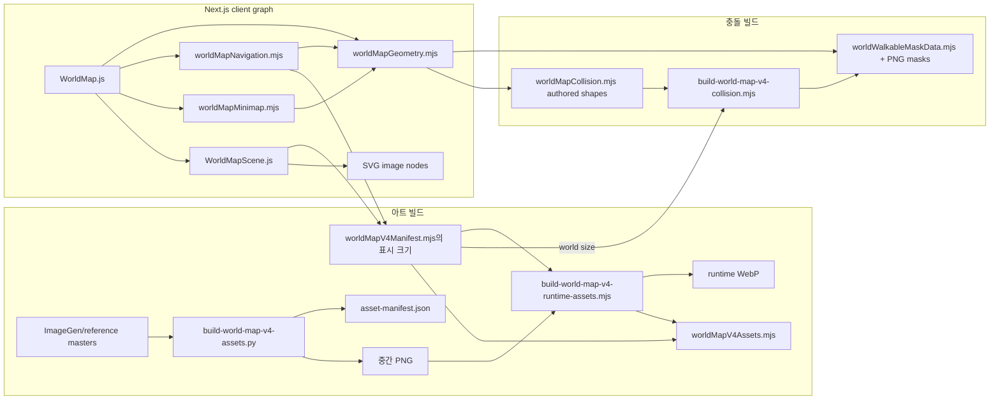

# World map v4 current architecture

조사일: 2026-09-26 (Asia/Seoul)  
범위: 현재 작업 트리의 읽기 전용 조사. 프로덕션 코드, 런타임 에셋, 충돌 마스크는 변경하지 않았다.

## 요약

현재 v4 월드는 하나의 오브젝트 모델이 아니라 다음 네 계열의 데이터가 `id`와 좌표 관례로 느슨하게 결합된 구조다.

1. `lib/worldMapV4Manifest.mjs`: 렌더 오브젝트, 소스→월드 스케일, `sortY`, 렌더 레이어, authored road polyline, 청크 컬링
2. `lib/worldMapGeometry.mjs`: 런타임 목적지, 상호작용점/범위, 플레이어 이동과 4px 마스크 조회
3. `lib/worldMapCollision.mjs`: 논리 충돌 오브젝트와 래스터화 의미론
4. `lib/worldMapMinimap.mjs`, `lib/worldMapNavigation.mjs`, UI 컴포넌트: 위 데이터의 파생물과 별도 표시 메타데이터

`lib/worldMapV4Manifest.mjs:126`의 주석은 Home 좌표·충돌·입구가 하나의 원천을 공유한다고 설명하지만, 실제로는 Home 목적지가 manifest와 geometry에 중복되고 충돌은 별도 모듈에 있다. `collision: []`도 모든 렌더 오브젝트에 남아 있어 현재의 실제 충돌 authority를 잘못 암시한다.

완료된 충돌 시스템은 유지해야 한다. 현재 물리 authority는 `lib/worldMapCollision.mjs`의 `objectId/colliderId/collisionRole/shapes` 선언이며, `scripts/build-world-map-v4-collision.mjs`가 1 world-pixel 래스터 → 29×17px 발 clearance → 4px max-pool → packed mask를 생성한다. 런타임 이동은 `lib/worldMapGeometry.mjs`에서 이 사전 생성 마스크를 한 점 조회한다. 렌더 알파는 충돌 입력이 아니다.

## 현재 데이터 흐름

정적 ES import 순환은 현재 발견되지 않았다. 그러나 다음 결합이 있다.

- `worldMapV4Manifest.mjs`가 collision 모듈을 import/re-export하므로 렌더 manifest가 물리 모듈에 의존한다.
- collision builder가 collision 모듈을 직접 import하면서 world size 때문에 manifest도 import한다. 결과적으로 같은 collision 모듈을 두 경로로 읽고 generated asset module까지 Node 빌드 그래프에 포함한다.
- runtime asset builder는 기존 generated `worldMapV4Assets.mjs`를 입력 목록으로 import하고 새 파일을 다시 쓴다. 정적 순환은 아니지만 “이전 출력이 다음 입력 목록”인 시간적 self-dependency다.
- `WorldMap.js`와 `WorldMapScene.js`는 `'use client'` 경계다. 설치된 Next.js 16.2.7 문서에 따르면 Client Component가 import하는 모듈은 client module graph에 들어간다. authored provenance나 빌드 전용 validator를 manifest에서 직접 import하면 브라우저 번들로 전파될 수 있다.

## 영역별 실제 authority

| 관심사 | 현재 선언/생성 위치 | 런타임 소비 위치 | 현재 성격 |
|---|---|---|---|
| 월드 크기/타일 크기 | `worldMapV4Manifest.mjs`, `worldMapGeometry.mjs`에 중복 | camera, movement, minimap, builders | 중복 authored 상수 |
| 렌더 에셋 레지스트리 | generated `worldMapV4Assets.mjs` | manifest, scene, preload | generated runtime |
| 렌더 위치/크기 | `worldMapV4Manifest.mjs` | scene, culling, preload | authored/계산 혼합 |
| 소스 crop/provenance | `build-world-map-v4-assets.py`, `asset-manifest.json` | 빌드·검토만 | build-only, 중복 |
| anchor | manifest의 `anchorX/Y=0` | 실제 렌더에서는 별도 계산 없이 x/y 사용 | 명목상 필드, 의미 미정 |
| groundContact | 없음 | 없음 | 결손 |
| depth/sortY | manifest | scene에서 플레이어와 함께 수치 정렬 | authored |
| collision 선언 | `worldMapCollision.mjs` | collision builder, blocked reason | authored 물리 authority |
| 런타임 이동 충돌 | generated `worldWalkableMaskData.mjs` | geometry | generated runtime authority |
| 목적지/상호작용점 | geometry에 8개, manifest에 같은 8개 | WorldMap, actors, minimap, navigation | 중복 authored |
| 상호작용 범위 | geometry 전역 64×48 half extent | WorldMap | 전역 authored, 경계 포함(`<=`) |
| authored road/guide path | manifest | minimap 도로, navigation의 참고 metadata | authored visual guide |
| 실제 auto-walk route | navigation이 마스크 BFS로 런타임 생성·cache | WorldMap QA auto-walk | runtime derived |
| minimap marker 좌표 | geometry 목적지에서 파생 | diagram | derived |
| minimap label/icon/color | `GameEngine.js`, `WorldMapDiagram.js` | diagram/UI | 별도 authored 표시 정보 |
| state | `homeHub.mjs`와 WorldMap local state | hotspot/minimap/UI | 오브젝트 외부 runtime state |
| visibility | scene의 layer/mode 조건 | scene | 컴포넌트 로직에 내장 |
| culling bounds | manifest x/y/width/height에서 파생 | spatial index/query | runtime derived |

## 렌더와 레이어

정상 모드의 SVG 순서는 다음과 같다.

1. 저해상도 `terrain-preview` 한 장
2. 카메라와 교차하는 960×960 terrain panels
3. `environment` cluster 이미지
4. `gameplay` 오브젝트와 캐릭터를 `sortY`, key 순으로 정렬한 그룹
5. 전역 `foreground` 이미지
6. interaction hotspot
7. debug overlay

현재 “오브젝트 하나 = image 하나”다. `WorldObject()`는 `object.assetId` 하나만 조회해 `<image>` 하나를 만든다. 한 논리 건물의 ground/body/foreground/overlay를 묶는 관계가 없고, 반대로 재사용도 object와 asset의 우연한 참조로만 표현된다. 예를 들어 `landmark-guesthouse`는 `landmark-home` 에셋을 재사용한다.

정상 spawn 카메라에서 정적 이미지 노드는 현재 9–14개 범위다(프리뷰 포함, 캐릭터/interaction 제외). 1280×720과 1440×900에서는 11개이며, initial preload가 잡는 고유 runtime asset은 10개, 전송 바이트 합계는 프리뷰 포함 약 3,020,860 bytes, decoded RGBA 추정은 약 52,609,156 bytes다. 전체 manifest는 30 assets, 7,439,806 bytes, decoded RGBA 추정 129,521,776 bytes다.

이 수치는 WorldObject 도입으로 자동 증가해서는 안 된다. 논리 오브젝트 수와 draw node 수를 분리하고, baked cluster는 그대로 한두 개의 layer로 유지해야 한다.

## 컬링

`createWorldMapSpatialIndex()`는 512px 청크에 `visual bounds`를 등록하고 `queryWorldMapObjects()`는 camera + 180px margin으로 후보를 거른다. terrain은 별도 linear filter와 64/96px margin을 쓴다.

현재 주의점:

- 청크 등록이 `<= floor(right/chunkSize)` / `<= floor(bottom/chunkSize)`라서 right/bottom이 청크 경계와 정확히 같으면 반개방 박스 기준으로 불필요한 인접 청크에도 등록된다.
- 최종 교차 검사도 경계 접촉을 visible로 취급한다. 시각 오류는 아니지만 큰 layer가 많아질수록 보수적 overdraw/preload가 커진다.
- preload는 `queryWorldMapObjects()`의 모든 object asset을 읽으며 scene의 `inspection`/mode 필터보다 앞선다. 따라서 실제로 그리지 않는 asset도 초기 camera에서 로드될 수 있다.
- 새 모델에서는 오브젝트 union bounds로 1차 cull하고, 통과한 오브젝트의 layer bounds로 2차 cull해야 여러 layer가 draw call을 불필요하게 늘리지 않는다.

## collision과 navigation

현재 collision 선언은 목적지 `tx/ty/w/h`에서 분리되어 있다. 이는 올바른 방향이다. 여덟 건물의 collider는 명시적 rect이며, rect/polygon은 `[left,right) × [top,bottom)` world pixel 규칙을 따른다. `decorative-nonblocking`은 validation 대상이지만 obstacle mask에서 제외된다.

이동은 packed 960×720 mask만 조회한다. authored shapes는 blocked reason 계산에도 사용되지만 매 프레임 정상 이동의 geometry source는 아니다. 이 계약을 WorldObject 전환 중에도 보존해야 한다.

Navigation에는 서로 다른 두 경로가 있다.

- `WORLD_MAP_V4_PATHS`: 사람이 작성한 보이는 도로 polyline. 미니맵 도로를 그리며 route 결과의 `authoredPoints` metadata로만 붙는다.
- `getWorldNavigationRoute()`: 4px clearance mask에서 spawn 기반 BFS tree를 만들고 실제 도착점까지 단순화한다. QA auto-walk가 이것을 쓴다.

따라서 authored guide path를 실제 walk route로 오해해 authority로 승격하면 안 된다. 접근점은 interaction의 canonical point에서 파생하고, route는 collision artifact에서 생성해야 한다.

## interaction, minimap, state

- 여섯 zone은 `WORLD_PORTALS`, Library는 `WORLD_MUSEUM`, Home은 `WORLD_HOME`이라는 서로 다른 export 형태다.
- interaction point는 `approach`가 있으면 그것을 쓰고, 없으면 destination tile box의 bottom-center를 쓴다.
- 근접 판정은 x ±64, y ±48이며 경계를 포함한다. collision의 반개방 규칙과 같지 않으므로 adapter가 이를 암묵적으로 바꾸면 회귀가 생긴다.
- minimap 좌표는 interaction point에서 파생되어 중복이 적지만 marker 표시 정보는 zone은 `ZONE_META`, Home/Library는 `LANDMARK_META`에 나뉜다.
- Home 상태(`default`, `decorating`, `invite-ready`, `visitor`)는 건물 visual이 아니라 hotspot/minimap CSS에만 반영된다.
- 잠금 상태도 WorldObject state가 아니라 WorldMap props와 marker/hotspot 로직에서 처리된다.

## 에셋 provenance와 drift

`build-world-map-v4-assets.py`가 reference crop과 polygon을 정의하고 `asset-manifest.json`을 쓰지만, runtime render manifest는 그 JSON에서 생성되지 않는다. crop box가 `worldMapV4Manifest.mjs`에 다시 적혀 있다.

특히 generated asset manifest의 semantic `sortReferenceY`와 runtime manifest의 `sortReferenceY`가 다르다.

| 대상 | asset builder / `asset-manifest.json` | runtime manifest |
|---|---:|---:|
| Library | 1147 (`box.bottom - 18`) | 1010 |
| Music | 2097 (`box.bottom - 18`) | 1910 |
| Home hub | world `1752` | world `1752` |

Library/Music의 차이가 의도된 gameplay depth line인지 오래된 값인지 현재 provenance만으로 판정할 수 없다. 마이그레이션은 현재 runtime 값을 그대로 보존하고, 별도 시각 승인 없이는 builder 값을 덮어쓰지 않아야 한다.

## 완료된 충돌 자료와 Home 선행안의 시간 순서

`world-map-home-circulation-step1`은 당시 inclusive-ceil collision builder 때문에 Home footprint right 1776을 collider right 1774로 줄이는 임시 보정을 제안했다. 이후 `world-map-object-collision-step2`가 1px 반개방 rasterization을 완료했고 right 1776으로도 x=1792 road cell이 walkable임을 검증했다. 따라서 `1774`는 현재 충돌 권위가 아니라 폐기된 과도기 분석값이다. Home의 미래 art/site 좌표 자체는 아직 프로덕션에 적용되지 않았다.

## 구조적 결론

현재 기능은 작동하지만 데이터 소유권은 다음 세 종류가 섞여 있다.

- 사람이 직접 쓰는 의미 데이터: crop, 배치, depth, collider, destination, guide road, marker presentation
- 빌드 산출물: WebP metadata, packed mask, collision PNG, asset manifest
- 런타임 파생 데이터: culling bounds/index, minimap point, BFS route, proximity state

통합의 핵심은 이 셋을 한 파일에 모두 넣는 것이 아니다. 하나의 authored WorldObject를 최종 의미 authority로 두되, build adapter가 현재 collision/manifest/geometry API와 가벼운 runtime projection을 만들어야 한다.
