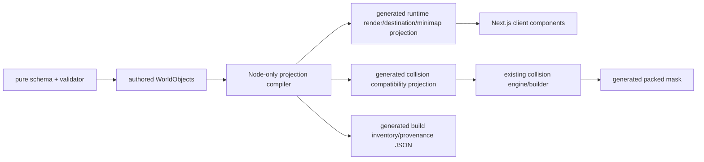

# WorldObject schema draft

## 권장 authority

세 후보 중 **3. 과도기 adapter를 사용한 점진 이전**을 추천한다. 다만 과도기가 끝난 뒤의 목표 authority는 **1. WorldObject가 collision 선언을 포함한 최종 authored 원천**이다.

이 조합은 서로 모순되지 않는다.

- 지금 즉시 기존 collision 모듈을 폐기하거나 다시 구현하지 않는다.
- pilot 동안 adapter가 WorldObject를 현재 `WORLD_MAP_V4_OBJECTS`, destination, collision 형식으로 투영하고 byte/shape parity를 검증한다.
- 모든 오브젝트가 이전되기 전까지 legacy source와 native WorldObject를 함께 읽되, **한 object id에 대해 authority는 항상 한쪽뿐**이어야 한다.
- 최종 단계에서만 legacy authored arrays를 제거한다.

### 후보 비교

| 후보 | 장점 | 위험/비용 | 판정 |
|---|---|---|---|
| 1. WorldObject가 collision 최종 원천 | 한 오브젝트의 의미가 한곳에 있고 transform 변경 시 visual/collision/interaction을 함께 검증 가능 | 즉시 전환하면 완료된 collision pipeline과 모든 목적지를 한 번에 건드림; authored 전체를 runtime에서 직접 import하면 bundle 오염 | 최종 목표 |
| 2. collision 모듈 유지 + WorldObject가 참조 | 현 collision 코드 변경 최소, 충돌 전문 모듈 경계 명확 | 오브젝트 이동 시 두 authored source를 함께 수정해야 함; `collision` 필드는 참조만 남고 장기적으로 split authority 지속 | 영구안으로 비추천 |
| 3. compatibility adapter | 오브젝트별 이전, projection parity, 즉시 rollback 가능 | 과도기 코드와 dual-format validator가 필요; 종료 조건이 없으면 영구 복잡성으로 굳음 | **현재 추천** |

## 설계 원칙

1. 논리 오브젝트와 파일은 다대다다. 한 오브젝트가 여러 visual layer를 가질 수 있고, 같은 asset을 여러 오브젝트가 참조할 수도 있다.
2. 모든 꽃/잔디/작은 돌은 오브젝트가 아니다. gameplay 의미가 없는 장식은 authored cluster 또는 baked ground에 남긴다.
3. authoring source와 runtime projection은 분리한다. provenance, source crop, validator hint는 client bundle에 넣지 않는다.
4. collision 의미론과 mask 포맷은 변경하지 않는다.
5. 숫자의 중복을 없애기 위해 `visual.bounds`, minimap point, navigation approach, `sortY`는 가능한 한 생성한다.
6. adapter는 현재의 naming과 경계 규칙까지 보존한다. 특히 interaction은 현재 inclusive half-extent이고 collision은 half-open이다.

## 좌표와 경계 규칙

- world origin: 좌상단 `(0,0)`
- 단위: world pixel; tile은 보조 표시 단위이며 1 tile = 32px
- 축: +x 동쪽, +y 남쪽
- rect 및 bounds: `[left,right) × [top,bottom)`; `width=right-left`, `height=bottom-top`
- visual/culling bounds: 불투명 alpha가 아니라 선언된 layer rect의 union. alpha는 collision 입력으로 사용하지 않는다.
- polygon: object-local 또는 world point 배열, even/odd fill, 오목 polygon 허용, maximum X/Y boundary는 half-open
- point: 면적이 없으므로 half-open 규칙 대상이 아니다.
- interaction proximity: migration parity 동안 `abs(dx) <= halfWidth && abs(dy) <= halfHeight`를 명시적으로 유지한다.
- transform: object-local point `anchor`가 world의 `transform.position`에 대응한다. 회전/스케일 적용 전후 공식은 `world = position + rotate(scale(local - anchor))`다.
- v1에서 collision을 가진 gameplay object의 rotation은 `0`, scale은 `(1,1)`만 허용한다. 임의 회전 collision rasterization은 범위 밖이다.

## 스키마 예시

아래는 형식 설명용 Library pilot 초안이다. 숫자는 현재 runtime 결과를 보존하기 위한 compatibility 값이며 구현 승인이 아니다.

```js
{
  schemaVersion: 1,
  id: 'landmark-library',
  kind: 'landmark',

  transform: {
    position: { x: 1146.9613259668508, y: 828.7292817679557 },
    rotationDeg: 0,
    scale: { x: 1, y: 1 },
  },

  anchor: {
    space: 'object-local',
    x: 0,
    y: 0,
    meaning: 'legacy-visual-top-left',
  },

  visual: {
    layers: [
      {
        id: 'body',
        role: 'body',
        assetId: 'landmark-library',
        rect: { left: 0, top: 0, right: 1544.7513812154696, bottom: 716.0220994475138 },
        renderBand: 'world',
        sortOffsetY: 0,
      },
    ],
    bounds: { mode: 'generated-layer-union' },
  },

  // x is compatibility metadata; y preserves the current sort line.
  groundContact: {
    space: 'world',
    point: { x: 1918, y: 1339.2265193370165 },
    confidence: 'legacy-derived',
  },

  depth: {
    mode: 'ground-contact',
    sortOffsetY: 0,
    legacySortY: 1339.2265193370165,
  },

  collision: {
    mode: 'authored',
    colliders: [
      {
        colliderId: 'library-body',
        collisionRole: 'building-body',
        space: 'world',
        shapes: [
          { type: 'rect', left: 1728, top: 1184, right: 2112, bottom: 1398 },
        ],
      },
    ],
  },

  interaction: {
    type: 'museum',
    destinationId: 'sound-library',
    legacyIds: ['Library', 'Sound Library'],
    point: { space: 'world', x: 1918, y: 1438 },
    activation: { type: 'axis-distance', halfWidth: 64, halfHeight: 48, inclusive: true },
  },

  navigation: {
    approachPoint: { mode: 'from-interaction-point' },
    route: { mode: 'generated-from-walkable-clearance-mask' },
    guidePath: { space: 'world', points: [{ x: 1920, y: 1504 }, { x: 1918, y: 1438 }] },
  },

  minimap: {
    visible: true,
    point: { mode: 'from-navigation-approach' },
    label: 'Sound Museum',
    icon: '🏛',
    color: '#C8A96E',
  },

  state: {
    visibility: { default: true, qaModes: ['all', 'objects'] },
    variants: [],
  },

  provenance: {
    sourceAssets: [
      {
        path: 'design/concepts/world-map-reskin-2026-09-18/02-sound-archive-garden-hd-master.png',
        crop: { left: 1730, top: 1250, right: 4060, bottom: 2330 },
      },
    ],
    generator: 'scripts/build-world-map-v4-assets.py',
    generation: 'masked HD reference crop, then display-size WebP',
    referenceRegistration: { width: 2896, height: 2172, worldWidth: 3840, worldHeight: 2880 },
  },
}
```

`legacySortY`와 world-space collider는 migration-only다. native object는 groundContact를 승인하고 collider를 object-local로 옮긴 뒤 두 compatibility escape hatch를 제거한다. 이 변환에서도 world-space projected shapes는 기존 값과 정확히 같아야 한다.

## 필드 계약

표의 “필수”는 최종 native object 기준이다. `baked-ground`/`static-decoration-cluster`는 gameplay 필드가 `null`일 수 있다.

| 필드 | authored / generated | runtime | build-only | 필수성 | 계약 |
|---|---|---:|---:|---|---|
| `schemaVersion` | authored | 선택 | yes | 필수 | validator/compiler 호환 버전 |
| `id` | authored | yes | yes | 필수 | world 내 유일한 kebab-case logical id; collider의 `objectId`로 투영 |
| `kind` | authored | yes | yes | 필수 | `baked-ground`, `static-decoration-cluster`, `landmark`, `building`, `prop`, `occluder`, `effect` 등 제한 enum |
| `transform.position` | authored | yes | yes | 필수 | anchor가 놓일 world point |
| `transform.rotationDeg` | authored, default 0 | 필요 시 | yes | 선택 | collision object는 v1에서 0만 허용 |
| `transform.scale` | authored, default 1 | 필요 시 | yes | 선택 | collision object는 v1에서 1만 허용; asset resize와 혼동 금지 |
| `anchor` | authored | projection에 필요 | yes | 필수 | object-local point. native building은 `meaning:'ground-contact'` 권장 |
| `visual.layers` | authored asset/role/rect | yes | yes | 최소 1개, 논리-only object는 0 허용 | 한 object에 `ground/body/foreground/occluder/overlay/effect` 여러 개 허용 |
| `visual.layers[].id` | authored | key/debug | yes | layer마다 필수 | object 안에서 유일 |
| `visual.layers[].role` | authored | render phase | yes | 필수 | 렌더 순서의 의미 분류 |
| `visual.layers[].assetId` | authored link | yes | yes | 시각 layer 필수 | asset registry key; 파일 경로 직접 중복 금지 |
| `visual.layers[].rect` | authored 또는 build metadata에서 생성 | yes | yes | 필수 output | object-local half-open display rect; source crop rect가 아님 |
| `visual.layers[].renderBand` | authored/default | yes | yes | 선택 | `ground`, `world`, `foreground`, `overlay`; role 기본값 사용 가능 |
| `visual.layers[].sortOffsetY` | authored/default 0 | yes | yes | 선택 | object sortY에 더하는 layer별 보정; global 999999 같은 sentinel 금지 |
| `visual.layers[].visibleWhen` | authored declarative rule | yes | yes | 선택 | 허용 state key/value만 사용; 함수 금지 |
| `visual.bounds` | **generated** layer union | yes | validator | 필수 generated | world half-open bounds; culling authority. 수동 override 금지, padding은 별도 허용 |
| `groundContact` | authored; anchor가 ground-contact면 generated `(anchor)` | depth/camera/debug | yes | modular gameplay object 필수, baked/cluster는 null | world 또는 local을 명시. native는 local 권장 |
| `depth.mode` | authored/default | yes | yes | gameplay visual 필수 | `ground-contact`, `fixed-band`, `none` |
| `depth.sortOffsetY` | authored/default 0 | yes | yes | 선택 | final `sortY = worldGroundContact.y + offset` |
| `depth.legacySortY` | authored compatibility | yes during migration | yes | migration-only | 현재 exact parity용; native 승인 후 금지 |
| `collision.mode` | authored | debug만 선택 | yes | 필수 (`none` 가능) | `authored` 또는 `none` |
| `collision.colliders` | authored | 현재 reason lookup; 향후 dev/compact projection | yes | `mode=authored`면 필수 | 기존 schema를 중첩하되 `objectId`는 top-level id에서 주입 |
| `colliderId` | authored | reason/debug | yes | collider마다 필수 | world-wide unique, 기존 id 유지 |
| `collisionRole` | authored | reason/debug | yes | 필수 | 기존 6개 role 그대로 유지 |
| `shapes` | authored | 현재 reason/debug | yes | 최소 1개 | rect/polygon, 기존 half-open/even-odd 규칙 그대로 |
| `interaction` | authored 또는 null | yes | validator | gameplay destination만 필수 | collision과 독립; visual alpha에서 생성 금지 |
| `interaction.point` | authored | yes | yes | interaction 존재 시 필수 | world/local 명시. door/approach와 의미가 다르면 별도 승인 필요 |
| `interaction.activation` | authored/default | yes | yes | 필수 | 현재 parity는 inclusive axis-distance 64×48 |
| `navigation.approachPoint` | **generated** from interaction 기본 | yes | yes | interaction object 필수 generated | 숫자 재입력 금지; 예외 offset은 근거와 validator 필요 |
| `navigation.route` | generated | QA auto-walk | build/runtime | 선택 | current mask BFS 계약 유지; authored points를 route로 사용 금지 |
| `navigation.guidePath` | authored | minimap road | yes | 선택 | 보이는 도로/디자인 guide. 실제 walkability를 보장하지 않음 |
| `navigation.protectedCorridors` | authored | no | yes | 선택 | Home site 같은 art/collision QA 영역 |
| `minimap.visible` | authored/default | yes | yes | 필수 | cluster/decoration은 보통 false |
| `minimap.point` | generated from approach 기본 | yes | yes | visible이면 필수 generated | 별도 숫자 금지; 명시적 offset만 허용 |
| `minimap.label/icon/color` | authored presentation | yes | yes | visible이면 필수 | 추후 localization key/token으로 교체 가능; 현 표시 parity 우선 |
| `state.visibility` | authored declarative | yes | yes | 필수/default | 현재 all/objects/inspection/clean 규칙을 데이터화 |
| `state.variants` | authored declarative | yes | yes | 선택 | Home 상태별 layer/minimap/interaction 차이. 함수·React node 금지 |
| `provenance` | authored/build enriched | **no** | yes | 필수 | source path, crop, generator, license/source note, registration, content hash |

## collision 연결 방식

WorldObject의 collider를 그대로 두 번째 배열에 손으로 복사하지 않는다.

```text
WorldObject.collision.colliders
  --compiler/adapter injects objectId-->
WORLD_MAP_V4_COLLISION_OBJECTS compatibility projection
  --existing buildCollisionMasks, unchanged-->
1px raw obstacle → 29×17 clearance → 4px max-pool → packed mask
```

필수 parity assertion:

- `objectId`, `colliderId`, `collisionRole`, shape type/order/coordinates가 기존 배열과 deep-equal
- generated mask hash와 현재 mask hash가 pilot 단계에서 동일
- 691,200 cells reason/mask parity 유지
- `decorative-nonblocking` 제외 동작 유지

## authored와 generated 모듈 경계

권장 의존 방향:



금지 의존:

- authored WorldObject가 `WorldMap.js`, React, `window`, DOM, generated asset module을 import
- client component가 provenance나 Node-only compiler를 import
- collision engine이 render manifest를 통해 collision data를 우회 import
- generated module이 authored module을 다시 import해 runtime에 build-only 필드를 끌고 들어오는 구조

Node compiler는 pure serializable data만 읽어야 한다. browser-only module을 빌드 스크립트에서 읽는 문제는 이 경계로 제거한다. Next.js client graph에는 generated lean projection만 들어간다.

## validator 필수 규칙

- schema/id/layer/collider id uniqueness
- finite coordinates, positive rect extent, polygon ≥3 points
- world bounds 및 asset reference 존재
- collision role enum과 기존 raster semantics
- native modular object의 groundContact 존재, `depth.sortY` derivation 일치
- visual layer union과 generated `visual.bounds` 일치
- interaction point가 world 안에 있고 approach/minimap이 같은 파생 source를 사용
- destination interaction hitbox 상호 비중첩
- guide path와 route의 의미 혼용 금지
- provenance가 runtime projection에 남지 않았는지 검사
- 한 id가 `legacy`와 `native` authority 양쪽에 동시에 존재하면 hard error
- generated artifact의 schema version/source hash가 authored input과 일치

## 열린 결정

프로덕션 구현 전에 다음을 승인해야 한다.

1. canonical destination id를 `sound-library`처럼 정규화하고 legacy alias를 adapter에서 유지할지
2. Library/Music의 현재 runtime sortY를 승인된 groundContact y로 간주할지, 별도 아트 검토로 groundContact를 다시 측정할지
3. blocked reason을 위해 production client에 full authored shapes를 계속 둘지, dev-only/compact reason index로 생성할지
4. state variant가 visual layer까지 제어할 범위와 서버/클라이언트 상태 키 목록
5. foreground를 global band로 유지할지 object-local occluder를 world sort queue에 합칠지
6. source crop/provenance의 canonical 저장 형식을 MJS data로 할지 JSON으로 할지
