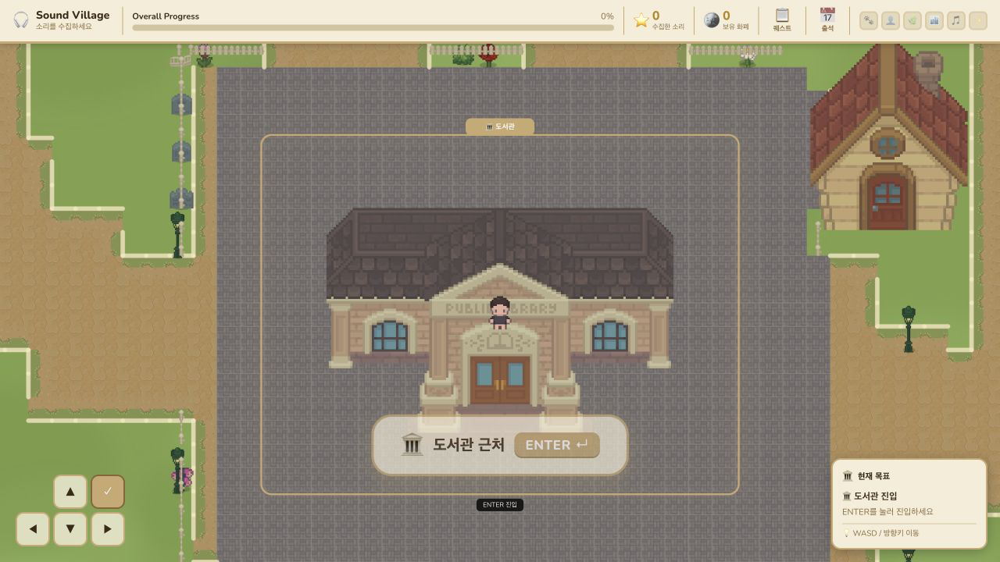
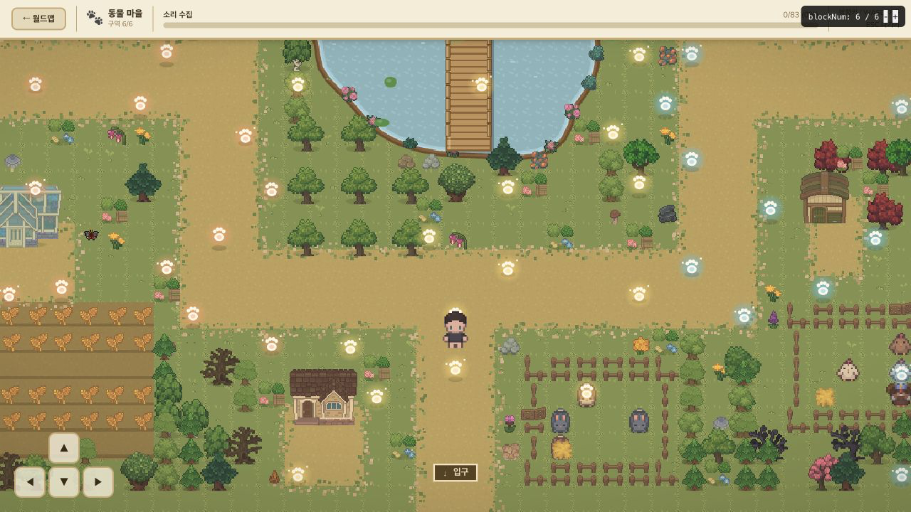
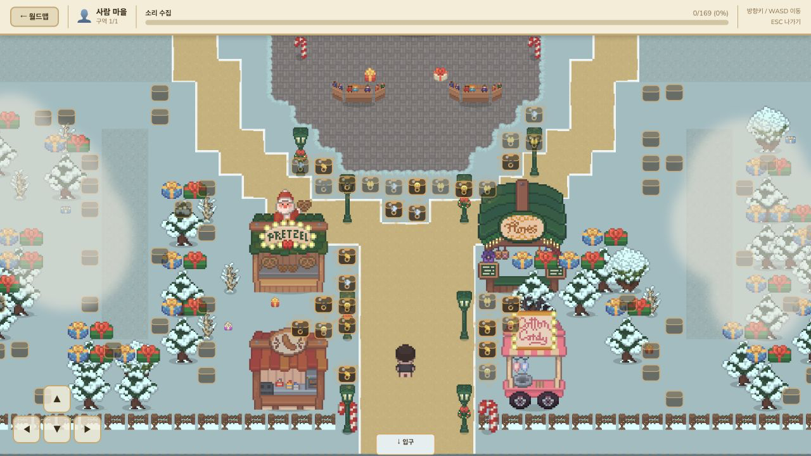
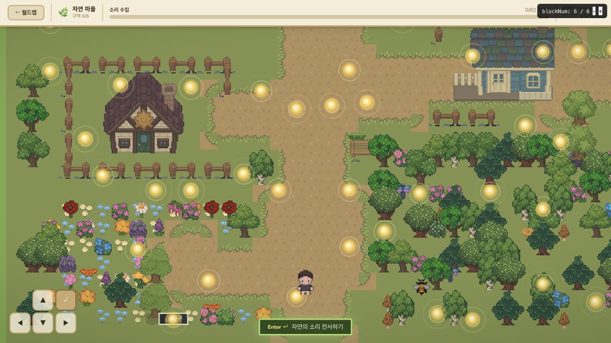
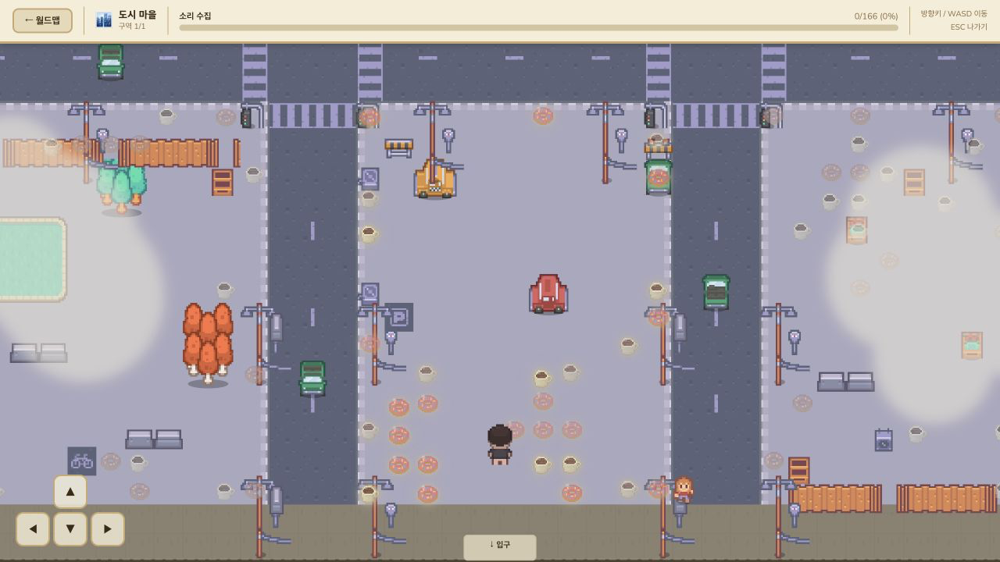
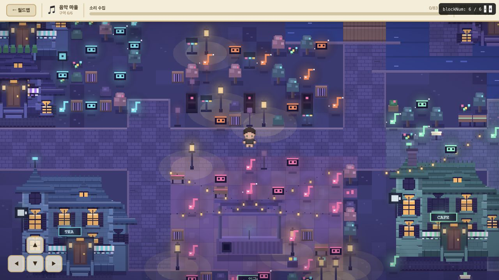
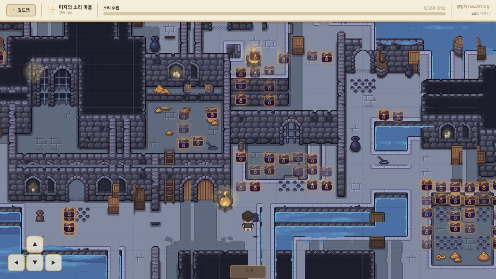
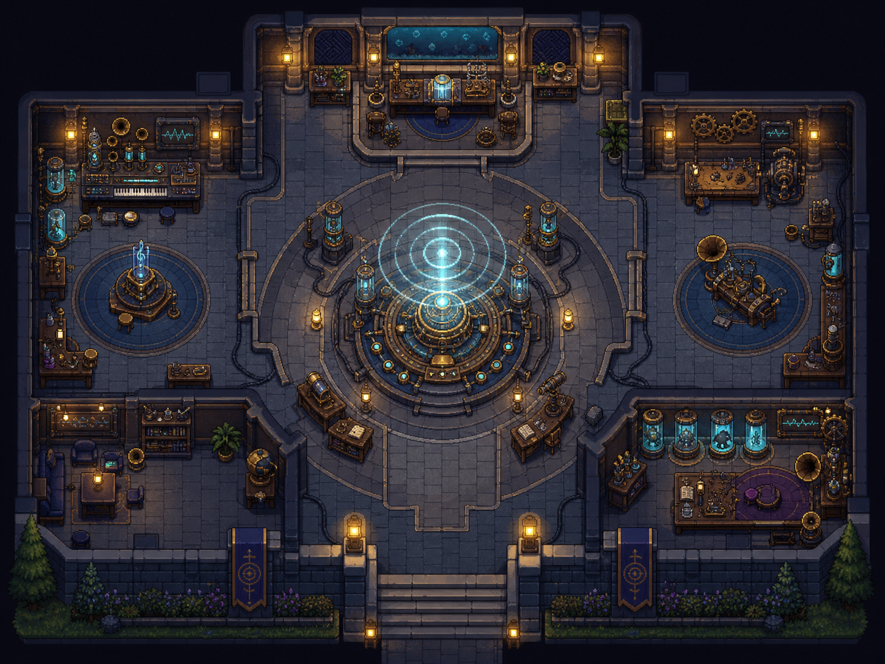

# Sound Village 2D 맵 리디자인 — 0단계 기준 감사

- 감사일: 2026-08-28 (Asia/Seoul)
- 프로젝트: `/Users/hyera/Documents/SoundVillage-house-decor-2d`
- 범위: 0단계(현 상태 보존 및 기준점 확립)만 수행
- 결과: 애플리케이션 코드·기존 에셋·Git 이력·Supabase를 변경하지 않고 기준 화면 7장과 이 문서를 추가했다.

## 1. 지침과 안전 조치

- 확인된 지침 파일은 루트의 `AGENTS.md` 하나다. 하위 경로에는 별도 `AGENTS.md`가 없다.
- 지침에 따라 코드 작성이 필요할 때는 Next.js 16.2.7의 `node_modules/next/dist/docs/` 관련 가이드를 먼저 읽어야 한다. 이번 단계에서는 애플리케이션 코드를 작성하거나 수정하지 않았다.
- 기존 변경을 삭제·되돌리기·덮어쓰기·stash하지 않았고, reset/checkout/commit/branch/push/merge/rebase를 실행하지 않았다.
- 루트 화면 진입 시 자동 출석 체크인이 Supabase 쓰기를 시도하므로, 월드맵 검증은 `/private/tmp/soundvillage-baseline-audit-20260828`의 격리 복사본에서 수행했다. `NEXT_PUBLIC_SUPABASE_URL`을 닫힌 로컬 포트로 지정해 외부 DB 쓰기를 차단했다.
- 마을 화면은 기존의 격리 테스트 경로를 사용했다. 최종 캡처는 개발 도구 배지가 섞이지 않도록 동일 소스의 격리 프로덕션 빌드에서 1280×720, DPR 2로 저장했다.
- 임시 격리 빌드의 `next build --webpack`은 성공했고 16개 정적 경로가 생성됐다. 이 빌드는 프로젝트 작업 트리의 `.next`나 소스 파일을 변경하지 않았다.

## 2. 현재 브랜치와 작업 상태

| 항목 | 상태 |
|---|---|
| 현재 브랜치 | `house-decor-2d` |
| HEAD | `bad3cb9` — `Reskin Human zone as Christmas market and fix pixel-art scaling blur` |
| upstream | 현재 브랜치에 추적 upstream 없음 |
| `main` 대비 | 공통 기준 `fabc721`; `main`에만 5개, 현재 브랜치에만 18개 커밋 |
| tracked 수정 | 2개: `app/page.js`, `components/ZoneMap.js` |
| 기존 untracked | 56개(이번 감사 산출물 제외) |
| staged 변경 | 없음 |
| 기존 tracked diff | 38 insertions, 20 deletions |
| 보존 확인값 | 기존 tracked diff SHA-256 `3c8cf5c2...2286`; 기존 untracked 묶음 SHA-256 `329935ef...38d4` — 감사 전후 동일 |

현재 브랜치는 `main`의 단순 최신 분기가 아니다. 집꾸미기·실시간 동행·다수의 2D 리스킨이 이미 18개 커밋으로 누적돼 있고, `main` 쪽에도 현재 브랜치에 없는 5개 커밋이 있다. 따라서 리디자인 브랜치를 만들기 전에 기존 작업을 기준 커밋으로 고정하고, `main` 동기화 여부를 별도로 결정해야 한다.

## 3. 변경 파일 분류

### 3.1 현재 작업 트리의 기존 변경(감사 산출물 제외)

| 범주 | 파일/경로 | 상태와 의미 |
|---|---|---|
| 집꾸미기 기능 | 현재 dirty 파일 없음 | 기능은 이미 브랜치 커밋 `6a2dfa6`, `ab94d3a`, `cc3244c` 등에 포함돼 있다. `WorldMap`의 우리 집 진입, 인테리어 저장·상점·방문 흐름을 보존해야 한다. |
| 실시간 동행 기능 | 현재 dirty 파일 없음 | 기능은 이미 `cc3244c` 등에 포함돼 있다. `lib/duoSession.js`, 월드맵/집 내부 동행과 초대 링크 흐름을 보존해야 한다. |
| 기존 맵 리스킨 | `app/page.js`(M), `components/ZoneMap.js`(M), `components/AnimalZoneMap.js`(U), `lib/animalVillage.js`(U) | Animal 전용 캔버스 맵을 제품 흐름에 연결하는 미커밋 작업과, 공용 SVG 맵의 레터박스를 없애는 반응형 뷰포트 변경이다. 새 리디자인과 직접 겹친다. |
| 테스트·미리보기 파일 | `app/animal-test/page.js`(U), `Cozy Christmas Market Map Design/` 일부 HTML/JS/scratch/uploads, `cozy animal village map design/`의 HTML/JS | Animal 시각 검증 경로와 외부/생성형 디자인 핸드오프 미리보기다. 제품 경로와 테스트 경로를 혼동하지 않도록 분리 유지가 필요하다. |
| 문서와 생성 이미지 | `Cozy Christmas Market Map Design/` 19개, `cozy animal village map design/` 32개, `design/concepts/lab-sound-observatory-concept-v1.png` | 사람 마을 겨울 마켓·동물 마을 핸드오프 및 미지의 소리 관측소 콘셉트다. 원본 자료로 보존한다. |
| 분류가 불확실한 변경 | `SoundVillage-house-decor-2d.code-workspace`, 각 핸드오프의 `.thumbnail`, `support.js`, `scratch/`, 중복 `uploads/` 이미지 | 개인 워크스페이스 설정·생성 도구 부산물·중간 이미지다. 기준 커밋에 넣을지 로컬 보관할지 사용자 결정이 필요하다. |

`app/page.js`의 dirty diff는 Animal 마을만 `AnimalZoneMap`으로 분기한다. `components/ZoneMap.js`의 dirty diff는 24×18타일 세로 시야를 고정하고 창 비율에 따라 가로 시야를 확장해 화면을 채우도록 바꾼다. 두 변경은 서로 다른 목적이므로 기준 커밋도 분리하는 편이 안전하다.

### 3.2 현재 브랜치에 이미 커밋된 주요 변경

| 범주 | 대표 커밋 | 내용 |
|---|---|---|
| 집꾸미기 | `6a2dfa6`, `ab94d3a`, `cc3244c` | 집꾸미기 포팅, 월드맵 진입, Cozy Room 인테리어·상점·방문 |
| 실시간 동행 | `cc3244c` | Supabase Realtime 기반 1:1 월드맵/집 내부 동행 |
| 기존 맵 리스킨 | `0dec382`~`50ce34a`, `c756db4`, `67904b0`, `bad3cb9` | 월드맵/미지의 소리/음악/자연/사람 마을 리스킨과 스케일링 변경 |
| 테스트·미리보기 | `app/*-test/`, `_review/`, `design_handoff_music_zone_map/` | 격리 테스트 페이지와 과거 QA 캡처 |
| 문서·생성 이미지 | `docs/`, `_review/`, 대규모 `public/house-assets/generated/` | 연구·UI 문서, 리뷰 이미지, 생성 집꾸미기 에셋 |
| 분류가 불확실 | `3434726` | 배포 재트리거 목적 커밋. 리디자인 기준과 직접 관계가 없으므로 이력 유지 외 추가 작업 금지 |

공통 기준 `fabc721` 이후 현재 브랜치는 9,802개 파일이 달라지며, 그중 약 91%가 `public/house-assets/generated/` 아래다. 맵 리디자인 브랜치에서 무심코 대규모 에셋 정리를 수행하면 집꾸미기 작업을 잃을 위험이 크다.

## 4. 맵별 현재 구현 방식

| 맵 | 제품 구현 | 크기/렌더링 | 소리·블록 연결 | 현재 시각 정체성 |
|---|---|---|---|---|
| 월드맵 | `components/WorldMap.js` | 120×90 타일 SVG 월드, 30×22타일 추적 카메라, 6개 포털+도서관+우리 집 | 마을별 진행률을 각각 표시하고 6개 진행률의 단순 평균을 Overall Progress로 사용 | 중앙 도서관 허브, 방사형+링 도로, 마을별 외곽 건물·정원 |
| 동물 | dirty `AnimalZoneMap` + `lib/animalVillage.js` | 48×36 타일 Canvas, 24×18타일 FOV, 절차적 농장 배치 | 실제 Animal 소리를 블록별 구역에 결정론적으로 배치; 제품 연결은 아직 미커밋 | 연못·다리·농장·우리·동물·발자국 수집 아이콘 |
| 사람 | 공용 `ZoneMap` | 48×36 타일 SVG, dirty 상태에서 세로 18타일 고정+가로 반응형 확장 | 제품에서는 그룹 필터와 실제 블록 진행을 공유 | 현재 기본판이 아니라 겨울 크리스마스 마켓 리스킨 한 종류만 존재 |
| 자연 | `NatureZoneMap` + `lib/natureVillage.js` + `data/nature_village_map.json` | 48×36 타일 Canvas, 정적 오프스크린 타일맵, 24×18 FOV | 실제 Nature 소리를 블록별로 결정론적 배치 | 올리브색 자연 마을, 오두막·꽃밭·숲·빛 구체 |
| 도시 | 공용 `ZoneMap` 내부 Urban 빌더 | 48×36 타일 SVG, Kenney 16px 에셋을 2배 스케일 | 제품 공통 소리/annotation/블록 흐름 사용 | 넓은 도로·교차로·차량·가로등·건물 3동; 현재 화면은 빈 공간 비중이 큼 |
| 음악 | `MusicZoneMap` + `lib/musicVillage.js` | 48×36 타일 Canvas, 절차적 야간 거리, 24×18 FOV | 6개 district에 Music 블록을 결정론적 배치 | 네온 야간 레코드 거리·무대·음표/테이프 아이콘 |
| 미지의 소리 | 공용 `ZoneMap` 내부 Lab 던전 | 48×36 타일 SVG, 구매한 던전 스프라이트를 2배 스케일 | Lab 소리를 던전 바닥 화이트리스트에 배치; 자체 셀프체크 PASS | 물길·석벽·감옥·상자 중심의 던전. 관측소 콘셉트와 구조·톤이 크게 다름 |

주의: 격리 테스트 경로 중 Animal/Nature/Music은 그룹 A와 6/6 블록을 사용하지만, Human/Urban은 전체 zone 소리를 `blockTotal=1`로, Lab은 전체 zone 소리를 6/6으로 표시한다. 따라서 아래 캡처는 **맵 렌더링 기준**이며 특정 실제 참여자의 아이템 수·현재 블록을 재현한 연구 세션 캡처는 아니다.

## 5. 기준 화면

모든 캡처는 1280×720이다.

### 월드맵

### 동물 마을

### 사람 마을 — 현재 겨울 버전

현재 코드에는 비겨울 기본판과 겨울 이벤트판을 런타임에서 선택하는 분리가 없다. 5단계에서 두 버전을 분리하려면 시각 레이어/맵 설정 분리부터 설계해야 하며 annotation 흐름은 공유해야 한다.

### 자연 마을

### 도시 마을

### 음악 마을

### 미지의 소리 마을 — 현재 던전 버전

## 6. 미지의 소리 관측소 콘셉트 연결

기준 콘셉트: [lab-sound-observatory-concept-v1.png](../concepts/lab-sound-observatory-concept-v1.png)

현재 던전은 소리 아이템이 여러 방과 복도에 조밀하게 놓이는 탐색형 구조다. 관측소 콘셉트는 중앙 원형 장치와 기능별 연구실이 시선을 조직하는 대칭형 허브다. 3단계에서 콘셉트를 그대로 복제하기보다, 현재 블록별 아이템 접근·충돌·입구·카메라 규칙을 유지하면서 관측 장치가 소리 발견 체계를 설명하는 기준점이 되도록 재해석해야 한다.

## 7. 반드시 보존해야 하는 기존 기능

1. `data/sound_metadata.json`의 `game_zone`, `group`, `block`, `sound_id` 연결과 그룹 필터.
2. `AnnotationPanel`의 재생·표현 입력·confidence·저장·스킵/제출 흐름과 `lib/supabase.js` 저장 계약.
3. 참여자별 완료 ID 복원, 블록 잠금/해제, 완료 오버레이, 마을 복귀 시 상태 유지.
4. 월드맵 포털 진입, 도서관(Sound Museum), 우리 집 진입, 퀘스트·출석 HUD.
5. 집꾸미기 구매·배치·저장·친구 방문과 이미 생성된 대규모 집꾸미기 에셋.
6. Supabase Realtime 기반 1:1 동행, 초대 링크, 월드맵↔집 화면 동행 전환.
7. 키보드/WASD·모바일 D-pad, 충돌, 카메라, 입구/나가기 확인, annotation 중 이동 정지.
8. 여섯 마을을 서로 다른 zone으로 유지하는 데이터 의미. 새 디자인 때문에 zone 이름이나 DB 구조를 합치지 않는다.

## 8. 충돌 가능성과 위험

| 수준 | 위험 | 영향/대응 |
|---|---|---|
| 높음 | 현재 화폐는 `participant_currency.balance` 하나이며 annotation 보상도 `earn_annotation=5`의 통합 화폐다. | 승인된 제품 맥락의 마을별 화폐/재료 분리와 불일치한다. 2단계에서 우선 UX·명명·조합 규칙을 설계하고, DB/지급 로직 변경은 별도 연구·데이터 승인 없이는 금지한다. |
| 높음 | 첫 진입은 Music 구역 1을 완료해야 다른 다섯 마을이 열린다. | 여섯 마을 균형 참여 목적과 선택 편향 측면에서 검토가 필요하다. 현재 gameplay/연구 조건이므로 임의 변경하지 않는다. |
| 높음 | Animal 전용 엔진 연결이 미커밋이고 `app/page.js`와 직접 겹친다. | 리디자인 브랜치 생성 전에 원자적 기준 커밋으로 고정해야 한다. |
| 높음 | `ZoneMap.js` 하나에 Human/Urban/Lab 및 과거 Animal/Nature 구현이 함께 있고 파일이 매우 크다. | 마을별 변경이 다른 마을의 충돌·카메라·아이템 렌더링에 회귀를 만들 수 있다. 시각 레이어만 좁게 분리하는 전략이 필요하다. |
| 중간 | Human 기본판이 없고 겨울판이 기본 구현을 대체했다. | 5단계에서 기본/이벤트 설정을 분리하되 데이터와 annotation 컴포넌트는 공유해야 한다. |
| 중간 | SVG 공용 맵과 Canvas 전용 맵의 반응형 정책이 다르며, dirty `ZoneMap` 뷰포트 변경이 아직 검증/커밋되지 않았다. | 공통 디자인 바이블에서 FOV·픽셀 스케일·HUD 안전영역을 먼저 고정해야 한다. |
| 중간 | 개발 모드 Lab에서 `SoundItem` 애니메이션 opacity의 서버/클라이언트 부동소수점 차이로 hydration mismatch 경고가 재현됐다. | 프로덕션 화면은 정상이나 결정론적 시각 QA에 잡음이 된다. 이번 단계에서는 코드 수정하지 않았다. |
| 중간 | 직접 테스트 경로의 sound 필터/blockTotal이 제품 흐름과 일부 다르다. | 향후 기준 캡처는 연구용 그룹 A/B 고정 fixture 또는 읽기 전용 preview 규약을 승인받아야 한다. |
| 중간 | 현재 브랜치가 `main` 대비 5 behind / 18 ahead다. | 리베이스/머지는 리디자인과 섞지 말고 별도 승인·별도 통합 단계에서 수행한다. |
| 낮음 | 핸드오프 폴더에 중복 이미지·scratch·thumbnail·지원 JS가 있다. | 삭제하지 말고, 추적 여부만 사용자가 결정한다. |

## 9. 추천 브랜치와 안전한 기준 커밋 구성

추천 리디자인 브랜치 이름은 `codex/2d-map-redesign`이다. 단, 지금 바로 만들면 미커밋 사용자 변경이 기준 이력에 포함되지 않으므로 아래 순서가 안전하다.

1. `feat(animal): preserve dedicated Animal village implementation`
   - `app/page.js`, `components/AnimalZoneMap.js`, `lib/animalVillage.js`, `app/animal-test/page.js`
   - 필요한 Animal 핸드오프 자료는 같은 커밋 또는 다음 docs 커밋에 명시적으로 포함.
2. `fix(map): preserve full-viewport shared zone camera`
   - `components/ZoneMap.js`만 포함.
3. `docs(design): preserve existing village handoffs and concept`
   - `Cozy Christmas Market Map Design/`, `cozy animal village map design/`, `design/concepts/`.
   - `.thumbnail`, `scratch/`, 중복 uploads, `support.js`의 추적 여부는 먼저 결정.
4. `docs(2d-map-redesign): add phase-0 baseline audit`
   - `design/2d-map-redesign/BASELINE_AUDIT.md`와 `baseline/*.png`만 포함.
5. 위 커밋 후 작업 트리가 의도대로 정리됐는지 확인한 다음 `codex/2d-map-redesign` 브랜치를 생성.
6. `main`의 5개 고유 커밋을 가져올지는 브랜치 생성과 분리해 별도 승인. 자동 merge/rebase 금지.

`SoundVillage-house-decor-2d.code-workspace`는 개인 설정일 가능성이 높아 기본 추천은 **커밋하지 않고 로컬 보존**이다. 어떤 경우에도 승인 없이 삭제하지 않는다.

## 10. 다음 승인 지점

다음 행동은 1단계 디자인 작업이 아니라 **현재 미커밋 사용자 작업을 위 4개 기준 커밋으로 보존한 뒤 `codex/2d-map-redesign` 브랜치를 만드는 것**이다. 실행 전에 다음 두 결정을 받아야 한다.

1. 핸드오프 부산물(`.thumbnail`, `scratch/`, 중복 `uploads/`, `support.js`)을 기준 커밋에 모두 포함할지, 로컬 미추적 상태로만 보존할지.
2. 기준 커밋과 브랜치 생성까지만 승인할지, 그 뒤 1단계 공통 디자인 바이블 착수까지 함께 승인할지.

0단계에서는 어떤 커밋이나 브랜치도 만들지 않았고 1단계로 넘어가지 않았다.
