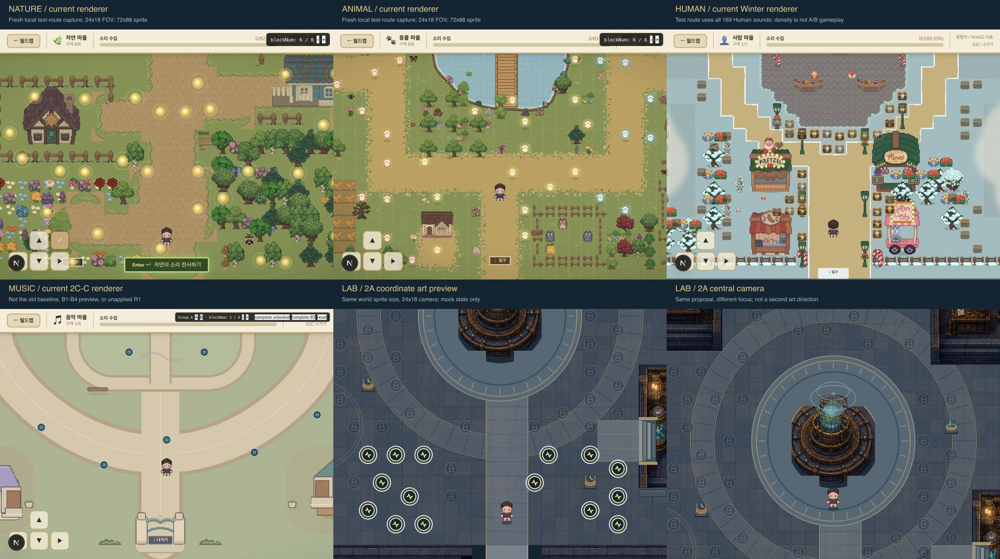
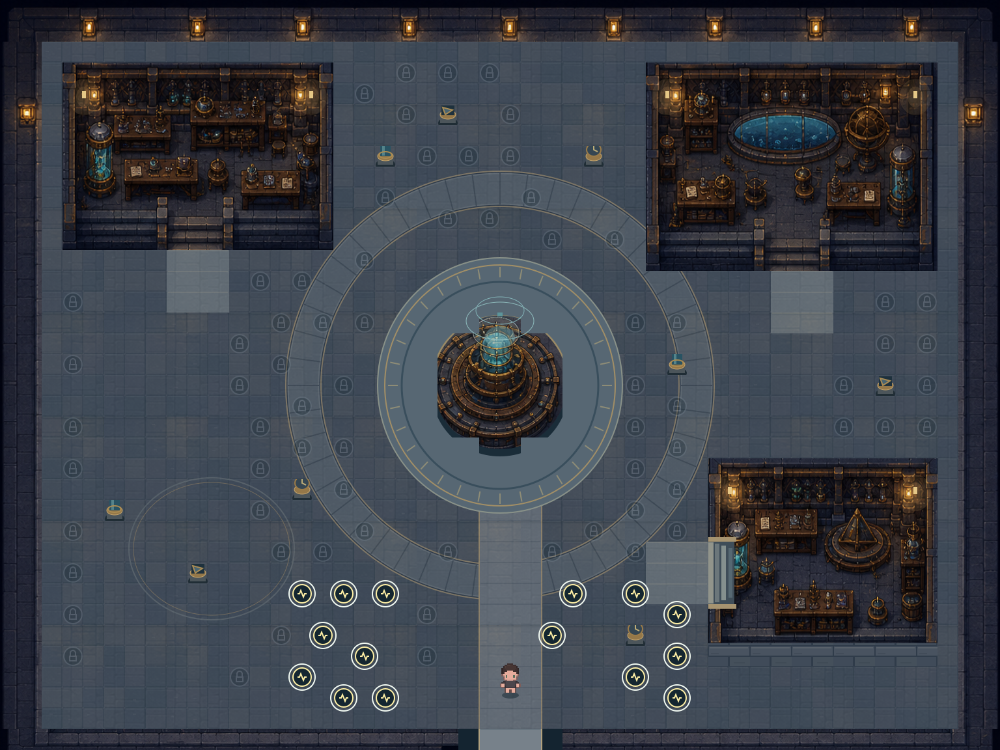
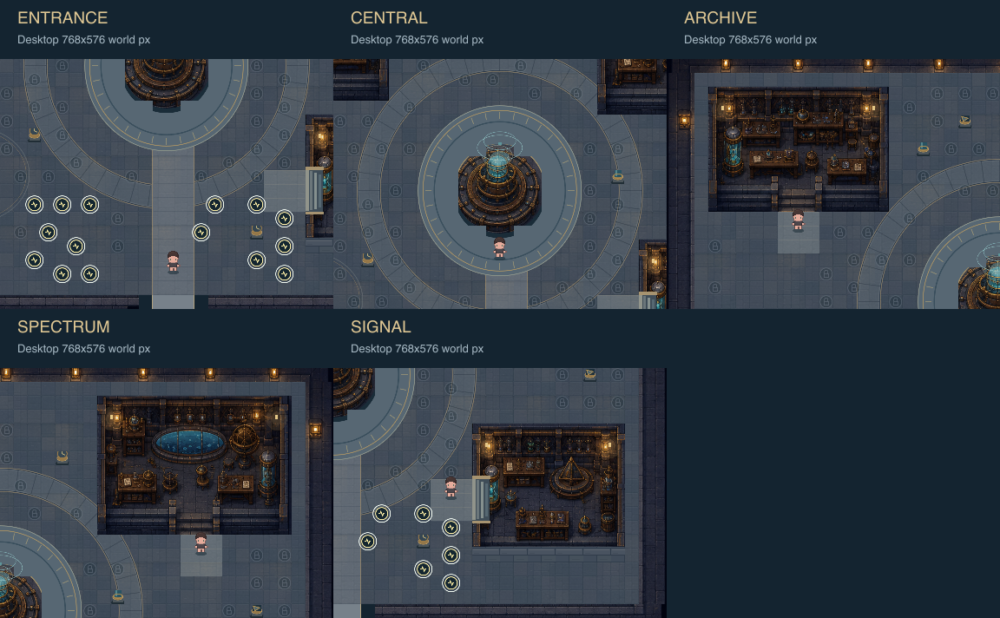
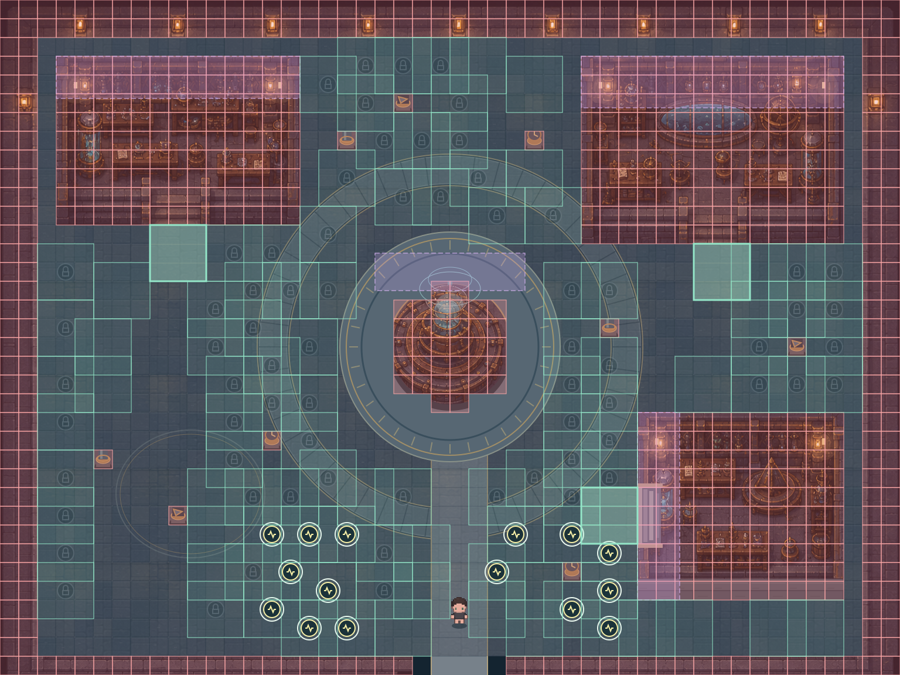
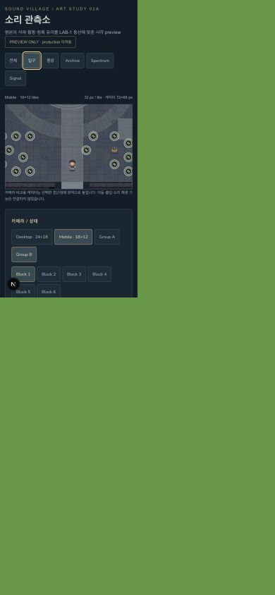

# LAB-2A — 원본 관측소를 유지한 좌표 기반 시각 preview

작성: 2026-08-30. 상태: **주 시안 1개 / 사용자 시각 검토 대기 / production 미적용**.

Preview: `/lab-observatory-art-preview` (로컬 서버 `http://127.0.0.1:3000/lab-observatory-art-preview`). 기존 `/lab-whitebox-preview`는 보존했다. LAB-2B, 최종 분리 에셋 생산, runtime collision 연결은 시작하지 않았다.

## 결과의 성격과 한계

이번 결과는 **좌표 기반 SVG 바닥·마스크 + 생성 시안의 구조물 부분을 제한해서 사용하는 혼합 preview**다. 생성 이미지 전체를 늘여서 플레이 맵으로 쓰지 않는다. 전체 생성 시안은 재료·분위기 참고 자료이고, 실제 preview의 좌표·동선·marker는 별도다.

- 원본의 두꺼운 석재, 황동 장치, 청록 유리, 작은 따뜻한 조명을 하나의 방향으로 해석했다.
- LAB-1의 48×36, 32px tile, entrance/approach, core, blocker, slot 생성 규칙은 변경하지 않았다.
- 전체 PNG를 감싼 SVG를 편집 가능한 아트 master라고 부르지 않는다. `observatoryArt.mjs`의 바닥·도형·마스크만 편집 가능한 geometry이며, 래스터 구조물 내부는 편집 불가능한 시안 이미지다.
- 생성물의 정밀 tile 정합성, true alpha 분리, 최종 sprite 품질은 보장하지 않는다. 후보 이미지를 clipping해서 좌표 밖 침범을 제한한 것이다.
- **Emissive on/off는 추가 발광 overlay만 제어한다.** 생성 구조물에 이미 들어간 조명색/밝은 lamp 픽셀은 남는다. 따라서 완전한 무발광 비교는 미완료다.
- 도형 바닥·회랑·작은 prop과 생성 구조물 사이에 재료 밀도 차이가 남는다. 원본과 완전히 동일한 완성도 또는 production art 승인으로 보고하지 않는다.

## 확인한 원본과 비교 자료의 상태

프로젝트 루트의 한글 NFD 파일명 `Codex 이미지 2026년 8월 30일 오후 03_52_53.png`를 검색해서 열었다. `design/concepts/lab-sound-observatory-concept-v1.png`도 열었으며 시각적으로 같은 관측소였다. LAB-1 문서·config·preview, 전역 아트 기준, Music production polish backlog를 읽었다. `AGENTS.md`와 설치된 Next.js 16.2.7의 pages/layouts 및 server/client components 가이드를 확인했다.

| 자료 | 이번 작업에서의 상태 / 용도 |
|---|---|
| 원본 관측소 두 이미지 | 주 시각 기준. 배치 자체를 복제하지 않음 |
| Nature | `NatureZoneMap` → `lib/natureVillage.js`, 구매 sprite 기반 현재 구현. `/nature-test` 새 촬영 |
| Animal | `AnimalZoneMap` → `lib/animalVillage.js`, handoff 이식 현재 구현. `/animal-test` 새 촬영 |
| Human | `ZoneMap`의 Winter market 현재 구현. `/human-village-test` 새 촬영 |
| Music | `MusicZoneMap` → `lib/musicVillage.js`와 `musicVillageConfig.mjs`, 현재 2C-C. `/music-test` 새 촬영 |
| `baseline/*.png` | 과거 감사 캡처. 현재 화면 대신 사용하지 않음 |
| Music B1/B2/B3/B4 자료 | 단계별 과거 시각 preview. 현재 production 화면으로 표시하지 않음 |
| Music R1-A/R1-B | 미적용 시안. 품질 상한이나 Lab 팔레트 기준으로 사용하지 않음 |

현재 구현은 `app/page.js`의 실제 renderer 선택도 확인했다. 비교용 test route는 참여자 session과 같지 않다. Nature/Animal은 마지막 block까지 보이는 테스트 상태, Human은 169개 전체 테스트 상태, Music은 Group A Block 1이다. 비교 보드는 **비례·재료·시점 비교**이며 marker 밀도가 동일한 실험 조건은 아니다.

## 원본 요소 유지·조정·제외

| 원본 요소 | 처리 | 이유 / 구현 |
|---|---|---|
| 원형 중앙 관측 장치 | 유지 | 중앙 core 안의 황동·유리 장치, 외곽은 평평한 원형 회랑 |
| 짙은 청회색 석재 | 유지·조정 | 건물은 어두운 접지면, 이동 바닥은 중간 명도 |
| 황동 구조·기록 도구 | 유지 | 세 bay에 공통 재료를 적용하고 추상 계측·기록 소품 사용 |
| 청록 유리 | 유지 | 창·측정 장치의 제한된 면적. 높은 대형 hologram은 축소 |
| 작은 따뜻한 조명 | 유지 | 정적인 task light. 별도 overlay와 원본에 남은 조명색은 구분 |
| 두꺼운 벽·기단·계단 | 유지·조정 | 차단 footprint 내부에만 깊이 표현. 통행 회랑에 새 계단 없음 |
| 주변 연구 공간 | 재배치 | Archive 북서 / Spectrum 북동 / Signal 동남, 원래 LAB-1 좌표 |
| 복잡한 길 위 장치·난간 | 제외 | 양방향 회랑, 접근 영역, slot 여백 보호 |
| 피아노·축음기·표본 생물 | 제외 방향 | 중립 계측·기록 도구로 요청. 특정 정답을 나타내는 아이콘은 별도로 만들지 않음. 생성물의 작은 불명확한 디테일은 최종 에셋 제작 때 재검토 필요 |
| 캐릭터·sound marker·UI·글자 | 환경에서 제외 | 독립 SVG와 실제 정적 sprite, 로컬 React 상태 |

## LAB-1 구조와 생성 시안의 차이

1. 맵 1536×1152. 남쪽 exit `[22,35,5,1]`, spawn `(24,33)`, main spine `x23..25/y24..35` 그대로다.
2. 중앙 visual footprint `[18,12,12,13]`, core `(24,18.5)` / radius 3.35 tiles 그대로다. 원형 바닥은 통행 가능한 매립 무늬로 표현했다.
3. Archive `[3,3,13,9]`, Spectrum `[31,3,14,10]`, Signal `[34,22,11,10]` 및 각 entrance·3×3 approach를 config에서 읽는다.
4. 생성 시안은 **Signal을 남향 계단으로 잘못 표현**했다. 좌표 preview는 남쪽 계단을 기단으로 덮고 서쪽 `[33,26,1,3]` 방향의 연구 bay 접근부를 별도 도형으로 보정했다. 보정 부분의 질감 차이는 남아 있다.
5. 생성 core 주변 바닥까지 일체화하지 않고 장치 부분만 core mask 안으로 자른다. 외곽 시설 벽도 기존 collision 안에서만 표시한다.
6. LAB-1 foreground 후보 영역에는 통행 가능한 tile이 **22개** 포함된다. 후보 좌표를 수정하지 않고 그대로 guide로 보여주며, 실제 높은 artwork는 기존 collision mask와 교차한 부분만 사용한다. 별도 좌표 변경이 필요하지 않았다.
7. marker는 환경·전경 다음에, 캐릭터도 별도 레이어로 표시한다. 이 preview의 순서는 가독성 비교용이며 production의 완전한 y-sort/가림 로직이 아니다.

## 캐릭터·다른 마을과 맞춘 기준

`components/ZoneMap.js`의 `SPRITE_W=72`, `SPRITE_H=88`과 `PixelChar`, `components/AssetRegistry.js`의 `WORLD_CHARACTER`를 확인했다. Nature·Animal·Music도 이 크기를 import한다. preview는 production renderer를 import하지 않고 기존 body/clothes/hair PNG의 down/idle 첫 32×32 frame을 **동일한 72×88 표시 영역**으로 겹친다. source sprite의 투명 여백 때문에 실제 보이는 몸은 이 사각형보다 작다. 배경에 맞추려고 캐릭터를 확대하지 않았다.

- 논리 tile 32px, 24×18/18×12 FOV, top-down 3/4 정면 깊이 공유.
- 문 앞 접근은 3 tiles 폭. 일반 주택 문이 아니라 열린 연구 bay 입구로 해석.
- 캐릭터의 발 기준은 선택한 approach point이며 카메라 전환 시 정적 비교 위치로 이동한다. 게임 이동 기능은 아니다.
- marker는 이중 ring·추상 파형, 완료 tick, 잠금 glyph의 mock 문법이다. 특정 sound/category와 연결하지 않는다.
- 그림자·접지감은 구조물 내부에서 유지하고 marker 주변에 높은 소품을 추가하지 않는다.
- pixel cluster의 최종 통일은 미완료: 생성 구조물과 도형 floor/prop의 edge가 다르다. 같은 게임의 최종 아트로 확정하려면 정리 필요.

## Lab 전용 조도 제안

전역의 밝은 낮 규칙을 수정하지 않는다. Lab에는 **안전한 저녁 관측 시설 + 중간 명도 바닥**을 제안한다. 어두운 석재의 정체성을 유지하고 길·approach는 더 밝게, 중앙 유리빛은 작은 면적으로 제한한다. 활성 marker의 흰 외곽선은 추가 청록 발광보다 강하게 둔다.

Emissive를 끄고 Grayscale을 켜도 주축과 marker는 읽힌다. 단, 생성 이미지에 내재된 lamp 색까지 꺼지지는 않으므로 완전 무발광 검수, 발광 면적 5% 이하 측정, 모든 배경의 국소 대비 정량 검수는 남은 항목이다.

## 전체 맵·카메라 화면

- Desktop world 768×576 PNG: `desktop-entrance`, `desktop-central`, `desktop-archive`, `desktop-spectrum`, `desktop-signal`.
- Mobile world 576×384 PNG: `mobile-entrance`, `mobile-central`, `mobile-archive`, `mobile-spectrum`, `mobile-signal`.
- PNG는 브라우저의 실제 SVG 표시 트리를 저장해 기존 sharp로 world px 크기에 rasterize했다. 실제 UI screenshot은 `browser-*.png`로 별도 저장했다.
- 전체 viewBox `0 0 1536 1152`; Desktop 입구 `384 576 768 576`; Mobile 입구 `480 768 576 384`.
- Mobile 중앙 `480 384 576 384`, Archive `32 128 576 384`, Spectrum `928 128 576 384`, Signal `896 672 576 384`.

## 검수 결과

| 검수 | 결과 |
|---|---|
| 기존 LAB-1 정적 검증 재실행 | PASS, warning 0, 연결 tile 1047 |
| 현재 metadata 읽기 감사 | Lab 169 / A84 / B85; 기존 block 분포와 동일, 수정 없음 |
| 안전 slot | 각 block 18개, 총108. A 또는 B 각각의 수용 후보이며 169개 동시 배치가 아님 |
| 추가 geometry 검사 | 108×9=972 clearance tile 검사, 세 3×3 approach, main spine, ring의 64개 표본, 정적 캐릭터 위치 PASS |
| foreground | 원래 guide 보존, 실제 높은 그림은 collision과 교차해 제한. slot 중심 침범 없음 |
| A/B Block 1~6 UI | 12 조합 직접 전환. A6 완료75/활성9/잠금0; B6 완료75/활성10/잠금0; B1 활성15/잠금70 |
| 실제 브라우저 | Desktop 1440×1000, 모바일390×844, 가로720×390. 모바일 document width와 scrollWidth 각각 동일, 가로 넘침 없음 |
| 토글 | 환경/marker/캐릭터/foreground 분리, grid/collision/foreground guide/clearance, grayscale, 추가 emissive overlay 확인 |
| 콘솔 | 최초 raw SVG hydration mismatch 발견 → 서버의 빈 art 상태와 클라이언트 삽입을 분리. 수정 후 새 검수 탭 warning/error 0 |
| ESLint | 새 preview 및 도구 검사 PASS |
| 기존 파일 보존 | 시작 전 9652개 파일 SHA-256 비교: 변경0 / 삭제0. 기존 미커밋 변경 보존 |

**미수행 / 미완료:** 실제 player 이동·벽 충돌·Enter 상호작용·출입·전경 y-sort gameplay, 실제 휴대폰 기기, production build, 완전 무발광 분리, 이미지별 pixel-perfect 경계 오차≤0.5 tile 측정, 최종 픽셀 클러스터 정리. 정적 검증을 실제 플레이 통과로 대체하지 않는다. 브라우저 automation에서 비활성 탭 SVG 읽기 timeout이 있었고 활성 검수 탭에서 재촬영했다.

## 이번 변경 파일

기존 파일은 수정하지 않았다. 신규 파일만 추가했다.

- `app/lab-observatory-art-preview/page.js`
- `app/lab-observatory-art-preview/ObservatoryPreview.js`
- `app/lab-observatory-art-preview/observatoryArt.mjs`
- `app/lab-observatory-art-preview/preview.module.css`
- `public/design-previews/lab-2a/material-study.png` — built-in ImageGen 결과 원본, 1448×1086. 요청 1536×1152가 그대로 반환된 것은 아님.
- `design/2d-map-redesign/tools/test_lab_2a.mjs`
- `design/2d-map-redesign/tools/export_lab_2a.mjs`
- `design/2d-map-redesign/tools/board_lab_2a.mjs`
- 본 문서.
- `design/2d-map-redesign/previews/lab-2a/` — PNG·SVG·검증 로그·시작 전 상태·파일 목록·프롬프트. 정확한 전체 목록은 `files.txt` 참조.

ImageGen은 built-in 도구를 한 번 사용했다. 원본과 좌표 도식을 입력했다. CLI/API 키 사용 없음. 최종 프롬프트는 `previews/lab-2a/imagegen-prompt.txt`. `material-study.png`는 생성 컨셉이고 `desktop-full.png`가 좌표 기반 혼합 preview다. `environment.svg`와 카메라 SVG는 SVG geometry와 PNG 참조를 함께 포함하는 snapshot이지, 전체 편집 가능한 벡터 master가 아니다.

production Lab/Music renderer·runtime asset, 다른 마을·world map, metadata/ID/group filtering, annotation/Museum/Supabase/DB, participant/session/재화/해금, 공용 설정·package 파일은 변경하지 않았다. preview에서 이들 state를 import하거나 호출하지 않는다. Git commit/branch/push 및 공개 배포 없음. 로컬 개발 서버만 실행했다.

## 승인 시 확인할 선택 사항과 LAB-2B 목록

승인 검토의 핵심은 **원본 석재·황동 분위기 + 중간 명도 길**의 조도 방향, 열린 연구 bay 해석, 기존 캐릭터 대비 구조물 밀도다. Signal 서향 입구의 깊이/재료 연결과 도형 바닥·소품의 밀도는 추가 정리 필요 항목이다. 이 시안을 최종 production 승인으로 간주하지 않는다.

승인 후 별도 LAB-2B에서 만들 분리 에셋 목록:

| 레이어 | 계획 |
|---|---|
| ground | 6 material zone, tile seam 변형, 평평한 radial inlay, main spine, 세 approach pad |
| building | Archive·Spectrum·Signal의 기단/body/개구부/뒤 벽, 중앙 core. west-facing Signal을 처음부터 정확히 제작 |
| foreground | LAB-1 후보와 허용 마스크에 맞춘 roof/canopy/cap, 투명 alpha와 가림 검수 |
| prop | 기존9 blocker용 중립 측정·기록 장치, pixel density를 캐릭터와 통일 |
| contact shadow | 건물·장치별 투명 접지 그림자. 통행 영역 침범 정량 검사 |
| emissive | lamp·glass의 진짜 분리 RGBA, 무발광 base와 overlay 독립 비교 |
| logical guide | 기존 좌표의 walkable/collision/clearance 자료. bitmap 색에서 추정하지 않음 |

**사용자 승인 전 LAB-2B나 production 교체를 자동으로 시작하지 않는다.**
