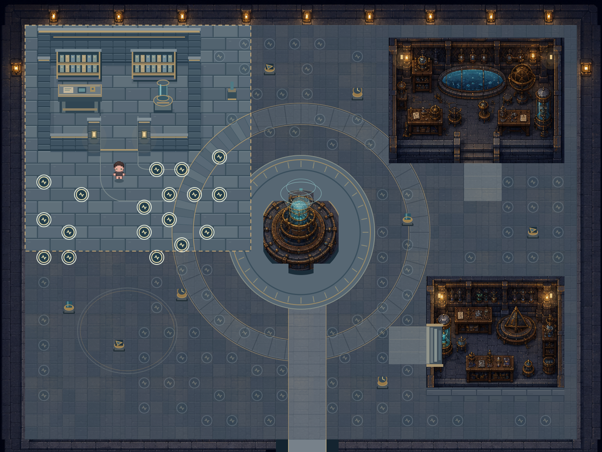
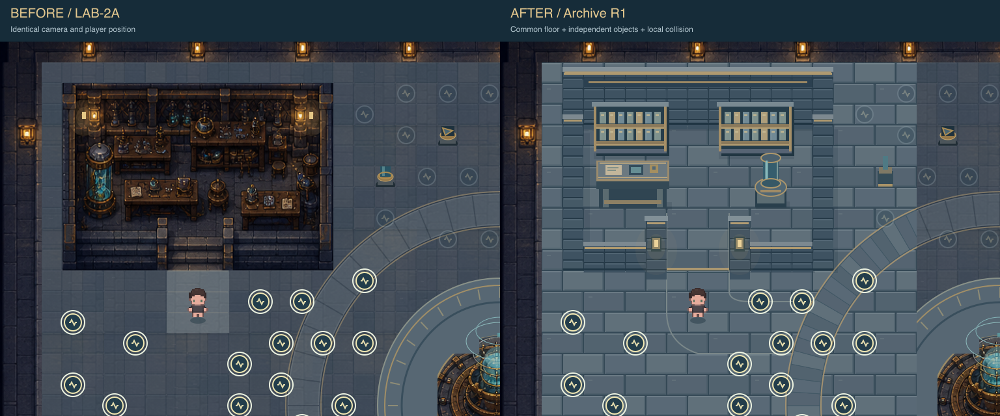
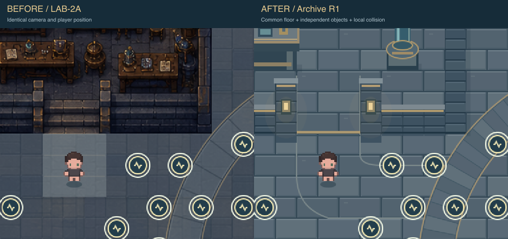
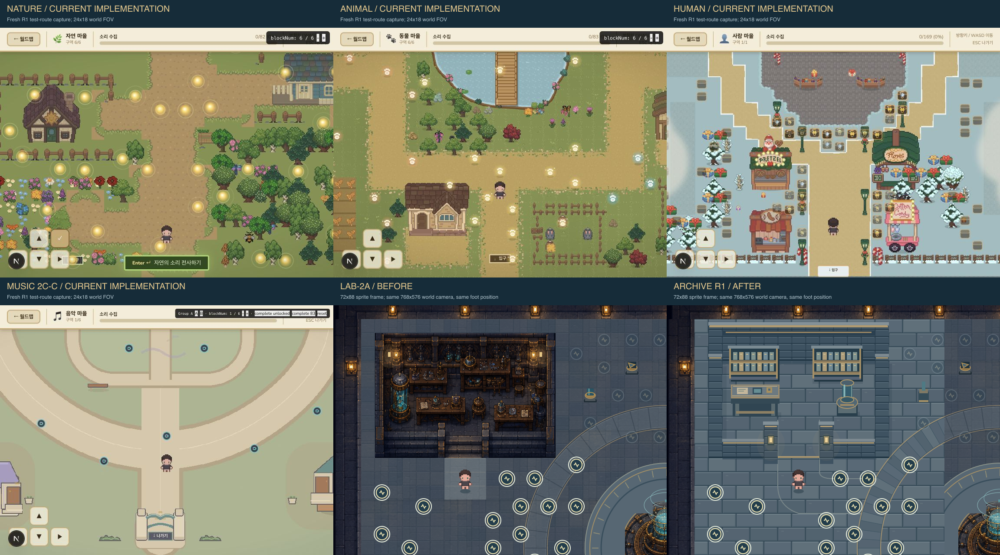
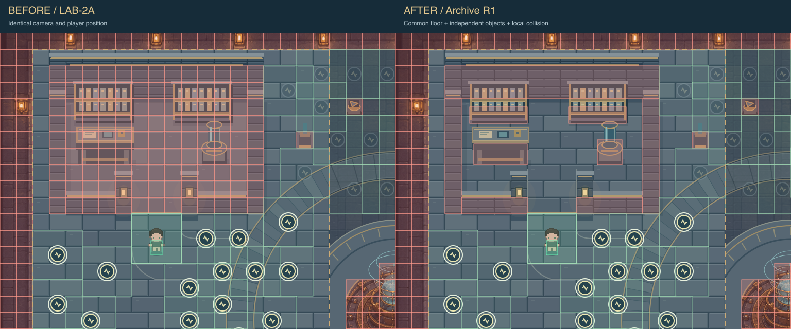
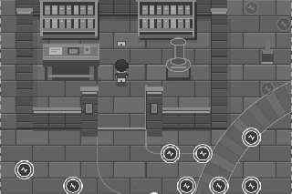
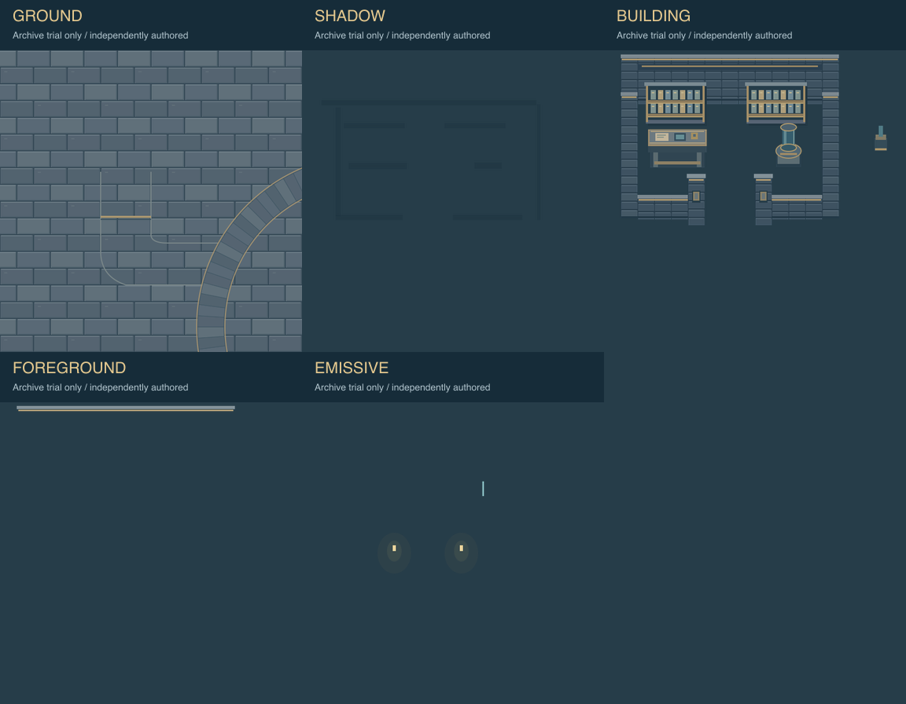

# LAB-2A-R1 — 관측소와 Archive 연구 공간의 연결감 개선

작성일: 2026-08-30  
상태: **Archive 시험 구간 구현 및 로컬 이동 검수 완료 / 사용자 검토 대기 / production 미적용**

Preview: `/lab-observatory-cohesion-preview`  
로컬 주소: `http://127.0.0.1:3000/lab-observatory-cohesion-preview`

기존 `/lab-whitebox-preview`와 `/lab-observatory-art-preview`는 보존했다. Spectrum·Signal 확대 적용, LAB-2B, production 교체는 시작하지 않았다.

## 1. 이질감의 원인과 R1 해결 방식

LAB-2A의 Archive는 풍부한 래스터 방 이미지, 바깥 광장과 원형 회랑은 편집 가능한 도형이었다. 내부 이미지는 사각형에서 끝났고 앞쪽 계단은 진입 가능해 보였지만 LAB-1 충돌은 Archive `[3,3,13,9]` 전체를 막았다. 따라서 바닥 노이즈나 색만 맞추는 방법으로는 해결할 수 없었다.

R1은 Archive만 다음처럼 다시 구성했다.

1. **공통 바닥:** 수정 구간 전체, 열린 bay 내부, 남향 문턱, 회랑과 인접 원형 링 일부를 같은 4-tone 청회색 flagstone family로 그렸다. 내부와 외부가 별도 이미지 경계에서 바뀌지 않는다.
2. **재료 전환 이유:** 입구 `[8,12,3,1]`에는 높이가 없는 황동 threshold와 낮은 명도 이음을 두었다. 계단처럼 보이는 높이 변화는 제거했다.
3. **열린 연구 bay:** 앞 2 tiles는 비우고, 뒤쪽은 큰 두 줄 선반, 기록 desk, 중립 유리 측정 장치로 정리했다. 읽기 어려운 작은 장식은 줄였다.
4. **납득 가능한 장애물:** 뒤 벽, 양 측벽, 남쪽 낮은 벽, 선반, desk, 장치에 발 위치 collision을 각각 두었다. 바닥 전체를 막지 않는다.
5. **독립 레이어:** 시험 구간의 ground, contact shadow, building/object, foreground, emissive를 코드 기반 SVG geometry로 분리했다. 방 사각형 이미지나 ImageGen crop을 사용하지 않았다.
6. **발 가림 완화:** y-depth 순서로 object를 그리며, 높은 object의 투영이 캐릭터 발과 겹치는 순간 해당 object만 32% opacity로 낮춘다. 실제 검수에서 desk가 자동 감쇠되는 것을 확인했다.

원본에서 청회색 석재, 황동 선, 제한된 청록 유리, 작은 따뜻한 lamp, 두꺼운 벽·기단, 안전한 연구 시설 인상을 유지했다. Lab을 잔디·베이지 마을로 바꾸지 않았다.

## 2. 정확한 시험 범위

| 항목 | 좌표 |
|---|---|
| 수정 clip / 도식 범위 | world `[64,64,576,576]`, tile `[2,2,18,18]` |
| Archive 외곽 | `[3,3,13,9]` — 변경 없음 |
| 남향 entrance | `[8,12,3,1]` — 변경 없음 |
| 3×3 approach | `[8,12,3,3]` — 변경 없음 |
| 연결 회랑 | entrance 남쪽과 동쪽의 flagstone apron, 위 clip 안 |
| 중앙 링 시험 부분 | clip 안의 북서 원형 paving 일부 |

범위 밖은 기존 LAB-2A를 그대로 사용한다. `environment-before.png`와 `environment-after.png`를 world 1536×1152 RGBA로 비교한 결과, **시험 범위 밖 변경 pixel은 0**이다. 결과는 `outside-scope-pixel-check.json`에 있다.

## 3. 같은 카메라·발 위치 Before / After

Before와 After는 모두 Desktop world viewBox `0 32 768 576`, 캐릭터 발 `(304,464)`, 72×88 sprite다. 아트와 충돌 선택은 독립되어 같은 그림에서 `기존 충돌`과 `제안 충돌`을 바꿀 수 있다.

연결 확대는 world `[192,224,384,320]`이다. 회랑→평평한 황동 문턱→앞쪽 석재 바닥이 한 재료 family 안에서 이어진다. 벽과 desk는 같은 1~2px edge, 좌상단 highlight, 우하단 contact shadow 문법을 쓴다.

## 4. 캐릭터 및 다른 마을과의 비례

현재 production 계열 기준을 다시 확인했다.

- `components/GameEngine.js`: `SPEED=3.9` world px / 16.67ms.
- `components/ZoneMap.js`: player collision `22×28`, 표시 sprite `72×88`.
- `AssetRegistry`: 32×32 first idle frame의 body/clothes/hair 레이어.
- Nature·Animal·Music도 공통 72×88 `PixelChar`를 사용한다.

R1은 이 값들을 preview-local snapshot으로 쓰며 production component를 import하지 않는다. 배경에 맞추려고 캐릭터를 확대·축소하지 않았다. 선반은 캐릭터 보이는 몸 높이와 비슷한 2.5 tiles, desk 상판은 약 1 tile, 장치는 약 2.5 tiles 높이로 읽힌다.

Nature·Animal·Human·Music 화면은 작업 도중 다른 파일 변경이 감지돼 기존 LAB-2A 자료를 그대로 최신 화면으로 쓰지 않고 현재 test route를 다시 촬영했다. Human test route의 169 marker 조건은 참여자 A/B 밀도 비교가 아니라 비례 참고다.

## 5. 충돌 변경: 기존과 preview 전용 제안

LAB-1 config는 수정하지 않았다. preview 전용 `cohesionConfig.mjs`가 Archive 전체 collision을 시험 화면에서만 해제한 뒤 아래 실형상 AABB를 추가한다.

| 실형상 | world collision rect |
|---|---|
| 뒤 벽 | `[96,96,416,64]` |
| 서/동 측벽 | `[96,160,32,224]`, `[480,160,32,224]` |
| 남쪽 낮은 벽 | `[128,352,128,32]`, `[352,352,128,32]` |
| 서/동 선반 | `[144,176,112,32]`, `[336,176,112,32]` |
| 기록 desk | `[152,248,104,40]` |
| 중립 장치 | `[392,240,48,48]` |

모든 override rect는 Archive footprint 안이다. entrance와 3×3 approach에는 겹치지 않는다. 높은 artwork를 collision mask로 자르지 않고 visual projection, ground-level collision, foreground를 따로 관리한다.

8px 발 위치 격자로 전체 1536×1152 공간을 탐색했다. 변경된 발 위치 표본 517개는 모두 Archive 안이며, 기존 walkable 표본을 새로 막은 곳은 0개다. 기존 map spawn에서 제안 collision을 사용한 연결 가능한 8px 발 위치는 15,032개였다. Archive 앞, 내부 aisle, 장치 우측 통로, 108개 slot 중심까지 도달했다.

## 6. 108 slot·접근 여백 보존

기존 LAB-1 검증 재실행 결과:

- PASS, warning 0, 기존 BFS 1,047 tiles.
- block별 safe slot 18개, 합계108.
- A `15/15/15/15/15/9`, B `15/15/15/15/15/10` 기준 불변.
- 108 slot 중심과 3×3 clearance 모두 기존 collision에서 안전하고 제안 solid와 겹치지 않음.
- 세 연구실의 기존 approach와 제안 solid 겹침 0.
- Archive 내부에 새 sound slot 추가 없음.

`static-validation.json`과 `lab1-validation.txt`에 결과를 저장했다. 108개는 A/B 각각 수용 후보이며 169개 동시 배치 검증이 아니다.

## 7. 실제 이동 검수와 정적 검증의 구분

### 실제 브라우저 이동

로컬 preview에서 실제 React 이동 상태와 동일한 `move()` collision 계산을 사용했다. 방향키/WASD는 3.9px one-frame minimum + 누르는 동안 requestAnimationFrame 이동, 지도 아래 화살표는 32px substep 이동이다. 둘 다 3px 이하 substep으로 tunnelling을 막는다. 모바일 hold pad도 같은 계산을 쓴다.

| 경로 | 실제 결과 |
|---|---|
| 키보드 ArrowUp 짧은 입력 | `(304,464) → (304,458.2)`, 입력 반영 |
| 기존 collision으로 문 접근 | y `414.5`에서 정지, 내부 진입 불가 |
| 제안 collision으로 문턱 통과 | `(304,304)`까지 앞쪽 연구 bay 진입 |
| desk 왼쪽 접근 | x `269.1`에서 접촉 후 정지 |
| 뒤 벽 접근 | y `190.5`에서 정지 |
| 장치 정면 접근 | y `318.5`에서 정지 |
| 장치 오른쪽 통로 | `(461.1,222.5)`까지 통과 |
| bay에서 회랑 복귀 | `(301.1,478.5)` 도달 |
| 서쪽 벽 접근 | x `141.1`에서 정지 |
| desk 뒤 foot occlusion | desk opacity `0.32`, 발·캐릭터 판독 유지 |
| 모바일 390px pointer input | 첫 입력 `464→458.2`, 5 step 후 y `298.2` 진입 |

실제 연속 hold의 장시간·대각선 코너 반복은 수행하지 않았다. 브라우저 자동화는 짧은 키 입력과 32px step button을 사용했다. 이동 로그는 `movement-browser.json`에 있다.

### 정적 검증

정적 검증은 AABB substep, 큰 delta tunnelling, 뒤/양 측벽·desk·장치 경계, 진입/복귀, 전체 8px reachability를 코드로 확인했다. 이는 실제 플레이 session 검수나 production collision 승인이 아니다.

## 8. Desktop·Mobile·가독성 검수

- Desktop 1440×1000에서 Archive camera world `768×576`, 연결 확대 `384×320`, 전체 `1536×1152` 전환 확인.
- Mobile browser 390×844에서 document width/scrollWidth 모두390, 가로 넘침 없음.
- Mobile framing world `576×384`, 실제 pointer 입력으로 연구 bay 진입.
- Grayscale + 수정 구간 emissive off 화면 저장. 길·threshold·실형상 분리 유지.
- Grid, 기존/제안 Collision, Foreground, Clearance, Mock marker, 수정 범위, Before/After toggle 확인.
- foreground 자동 감쇠 확인: desk projection과 캐릭터 발이 겹칠 때 해당 object만 `opacity=.32`.
- 최종 검수 탭의 console warning/error 0.
- 신규 preview와 세 도구의 ESLint 검사 PASS.
- SVG locator 추출 timeout은 read-only DOM 직접 읽기로 해결했다. 이동 검수 결과를 정적 자료로 대신하지 않았다.

수정 구간의 emissive는 base와 완전히 분리된 SVG다. Emissive off에서 R1 lamp/glass light가 제거된다. 다만 범위 밖 기존 LAB-2A 래스터 구조물의 내재 조명색은 남으므로 **전체 맵 완전 무발광 검수 통과**라고 보고하지 않는다.

## 9. 레이어 산출물

- `layer-ground.svg/png`: 공통 flagstone, flat threshold, 북서 radial paving.
- `layer-shadow.svg/png`: 벽·선반·desk·장치 접지 그림자.
- `layer-building.svg/png`: 뒤/측/낮은 벽, 선반, desk, 중립 장치.
- `layer-foreground.svg/png`: Archive top trim 시험 조각.
- `layer-emissive.svg/png`: 두 작은 lamp와 장치 유리빛.

이들은 Archive trial 범위의 code-native SVG geometry다. PNG wrapper나 ImageGen crop이 아니며 반복 도형은 편집 가능하다. production용 최종 pixel asset 또는 완성 atlas는 아니다. 이번 R1에서는 ImageGen을 사용하지 않았다.

## 10. 생성 파일과 보존 확인

기존 파일은 수정하거나 삭제하지 않았다. 시작 시 존재하던 9,709개 파일을 SHA-256으로 재검사했다. LAB-1/LAB-2A와 이번 작업이 보호하는 파일은 보존했으며 누락0이다. 다만 작업 중 `components/WorldMap.js`, `lib/animalVillage.js`, `lib/natureVillage.js`의 외부 변경이 감지됐다. 이번 R1의 도구 호출로 이 파일들을 쓰거나 되돌린 적은 없다. 따라서 저장소 전체 변경0이라고 보고하지 않는다. 외부 변경은 그대로 보존했다.

신규 파일:

- `app/lab-observatory-cohesion-preview/page.js`
- `app/lab-observatory-cohesion-preview/CohesionPreview.js`
- `app/lab-observatory-cohesion-preview/cohesionConfig.mjs`
- `app/lab-observatory-cohesion-preview/cohesionArt.mjs`
- `app/lab-observatory-cohesion-preview/cohesion.module.css`
- `design/2d-map-redesign/tools/test_lab_2a_r1.mjs`
- `design/2d-map-redesign/tools/export_lab_2a_r1.mjs`
- `design/2d-map-redesign/tools/board_lab_2a_r1.mjs`
- 이 문서와 `design/2d-map-redesign/previews/lab-2a-r1/`의 도식·PNG·SVG·검증 로그.

production Lab·Music, 다른 마을·world map, LAB-1 config·검증, LAB-2A 결과, sound metadata·ID·group·block, annotation·Museum·Supabase·DB, participant/session·재화·해금, package는 변경하지 않았다. preview는 production renderer, Supabase, metadata, audio, storage를 import/호출하지 않는다. Git commit/branch/push 및 공개 배포 없음.

## 11. 남은 한계와 사용자 확인 사항

Archive 연결 문제는 구조적으로 해결했다. 바닥은 이어지고, 보이는 앞쪽 바닥은 실제로 들어갈 수 있으며, 막힌 곳은 실형상과 일치한다. 하지만 이것은 **Archive 한 구간의 아트·collision prototype**이다. 원본의 미세 장식·유기적 마모 밀도는 아직 재현하지 않았고, R1은 더 단순한 도형 기반 표현이다. 연결 구조와 진입 가능성은 검증했지만 원본 분위기 충실도·최종 pixel/detail density의 미적 합격은 사용자 검토가 필요하다. 전체 production build, 실제 휴대폰 기기, 장시간 hold·대각선 코너 반복은 미검수다.

확대 적용 전에 사용자가 확인할 항목:

1. 기존의 풍부한 생성 방보다 디테일을 줄인 큰 선반·desk·장치 형태가 현재 캐릭터와 더 잘 맞는가.
2. Archive 벽이 독립 방보다 `한 시설의 열린 research bay`로 읽히는가.
3. 4-tone 2-tile flagstone과 방사 포장의 연결이 원본 석재 분위기를 충분히 유지하는가.
4. 앞 2 tiles의 여유 공간과 가운데 aisle 폭이 적절한가.
5. 발을 가릴 때 object를 32%로 감쇠하는 방식이 자연스러운가. production 단계에서는 foreground sprite 분할로 대체할 수 있다.
6. 승인 시 Spectrum·Signal도 같은 바닥 family와 열린 bay/collision 원칙으로 확대할지 여부.

사용자 검토 전 Spectrum·Signal 확대, LAB-2B 전체 asset 제작, production 교체를 시작하지 않는다.
