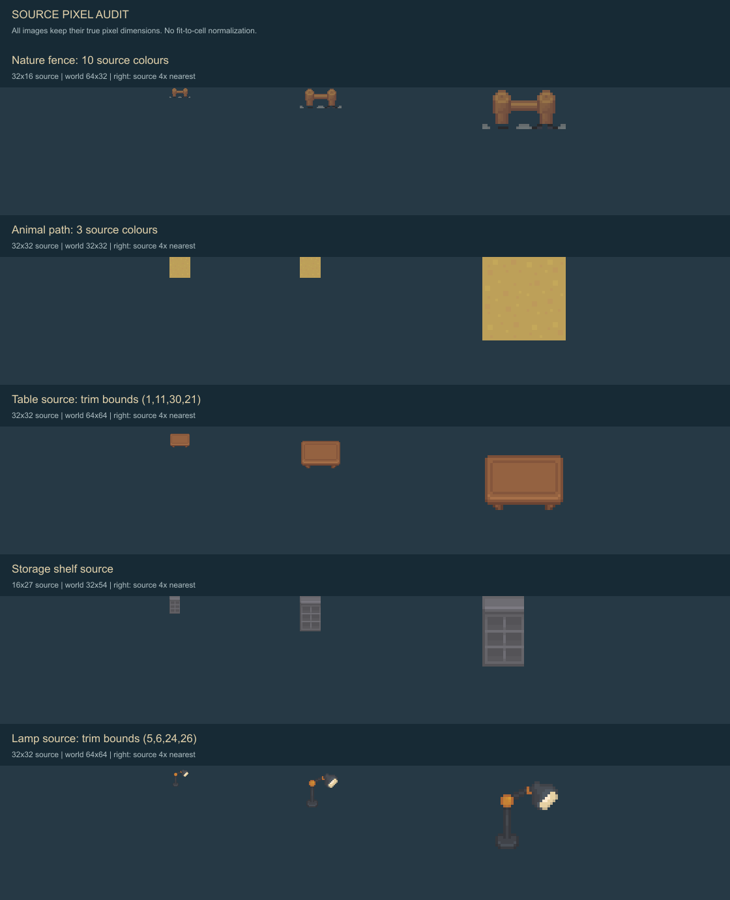
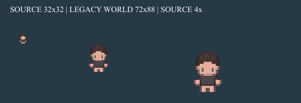
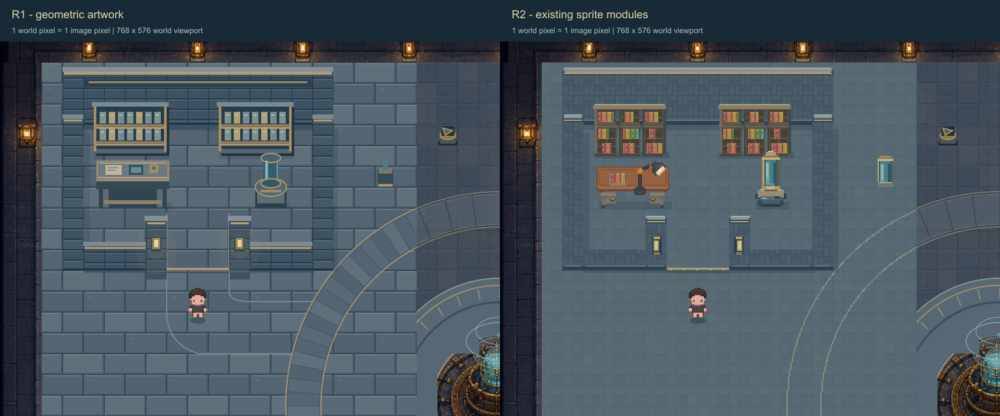
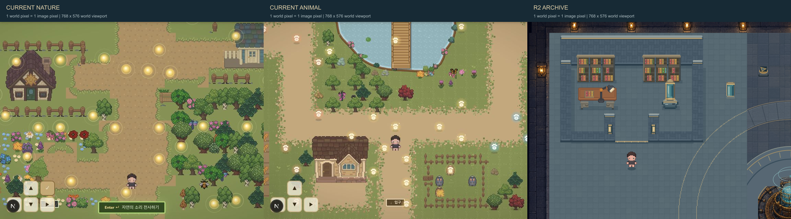
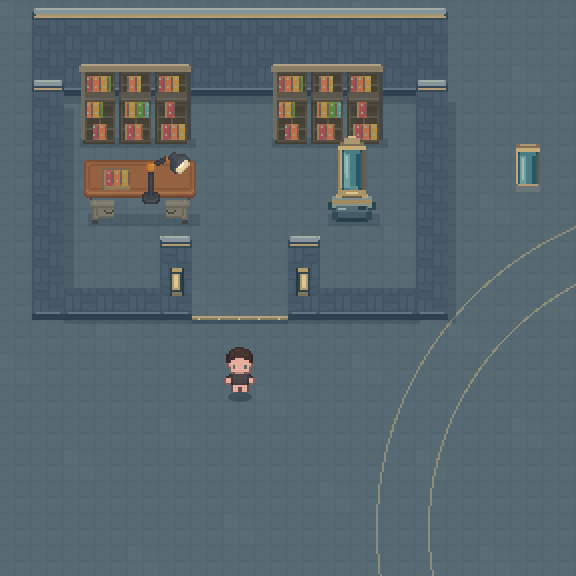
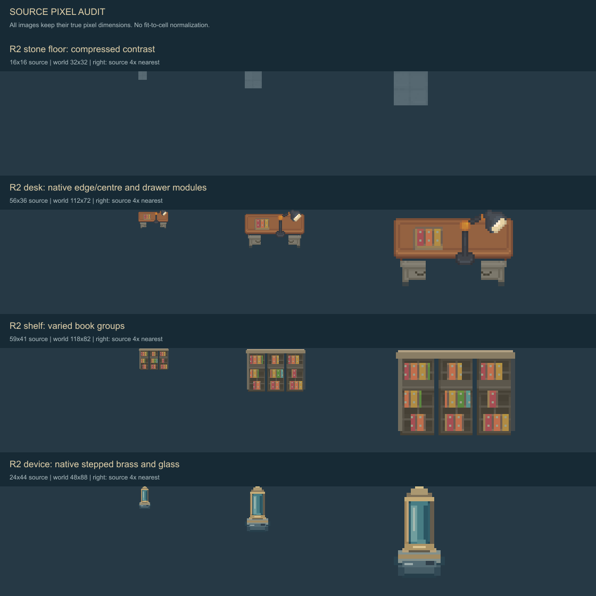

# LAB-2A-R2 — Archive 픽셀 표현 정렬

2026-08-30 · **Archive 격리 시험 결과 / 시각 승인 대기**

Preview: <http://127.0.0.1:3000/lab-observatory-pixel-preview>

R1의 위치·동선·충돌을 유지하고, 시험 영역 `[64,64,576,576]`의 아트만 교체했다. Spectrum·Signal·전체 Lab 제작 및 production 적용은 하지 않았다. 실제 sprite 기준으로 수정한 한 방향이며, 화풍 통일이 최종 승인되었다는 의미는 아니다.

## 원인과 적용 기준

R1은 64×32 world 단위의 큰 바닥 돌마다 밝은 1px 선을 두르고, 가구를 평면 직사각형으로 표현했다. 작은 책도 동일 간격으로 반복되었다. 장치의 매끈한 타원·얇은 선은 기존 sprite의 계단형 윤곽과 달랐다. 논리 tile 32px를 그림 원본 pixel 단위로 취급한 것이 차이를 키웠다.

이번에는 기존 sprite의 실제 원본 pixel을 기준으로 가구를 조합했다. 바닥과 벽만 색을 바꾼 것이 아니라 책상 테두리·서랍·선반 칸·책·램프의 원래 형태와 명암을 사용했다. 관측 장치는 적합한 대체 sprite가 없어 24×44 원본 pixel의 계단형 실루엣으로 새로 그렸다. ImageGen은 사용하지 않았다. 원본 PNG crop, native pixel 모듈 조합, 새 장치의 직접 raster pixel 제작이다. R1 화면을 축소하거나 SVG를 PNG로 변환해 아트로 사용하지 않았다. SVG는 레이어 배치·검수 표시와 비교판의 글자에만 사용한다.

전역 문서의 “32px PNG / 1px edge / 임의 2× 규격을 도입하지 않음”은 현재 Nature의 실제 source16→world32 렌더와 구분해야 한다. R2는 **preview 에셋 원본1px→world2px**를 채택했다. 공용 문서는 변경하지 않았다.

## 실제 픽셀·비례 조사

| 대상 | source crop | world 표시 | 최소 색 덩어리 / 경계 | 명암·면 구성 |
|---|---|---|---|---|
| Nature terrain | 16×16 | 32×32, 2× | source1→world2px | grass 기준 crop은 단색. 잎 밀도를 석재 목표로 사용하지 않음 |
| Nature 울타리 | 32×16, alpha32×15 | 64×32, 2× | 경계 source1px, world2px | crop 10색, 상단 밝음·정면 중간·아래 접점 어두움 |
| Nature 집 예시 | 62×75 at `[864,37]` | 124×150, 2× | 대체로 source1px 경계 | 지붕·정면·문 구분. 현재 objects 297개 모두 실제 src/size 조사 결과 2×2 |
| Animal 길 | 32×32 at `[80,40]` | 32×32, 1× | 최소 world1px | crop 3색. Nature와 같은 배율이라고 추정하지 않음 |
| Animal 건물 | cream58×72 등 | 기본2× →116×144, 개별 override 가능 | source1→world2px | 현재 코드의 BUILDING_SCALE 및 개별 scale 참조 |
| Animal 동물·소품 | 동물16/17/20/24 등 | 동물2.25×, 소품1×/1.5× 및 식생1.05~1.6× | 반올림에 따라 화면1~3px 혼합 | 이번 환경 sprite 기준을 동물 배율로 통일하지 않음 |
| 기존 Lab table | 32×32 안 alpha `[1,11,30,21]` | R2 모듈 조합56×36→112×72 | source1px 테두리→world2px | 원본6색. 상판 테두리와 아래 다리 포함; 파생 책상은 상판약20/36, 서랍·다리12/36, 측면 1~3px |
| 기존 storage shelf | 16×27 | 3칸+한 줄 조합59×41→118×82 | source1px 세로 구획 | 원본6색, 어두운 칸 내부·중간 정면·밝은 윗판. R2 윗판약4/41, 정면34/41, 측면2px |
| 공통 캐릭터 | 32×32, 합성 alpha `[9,12,14,20]` | 기존72×88 유지 | 원래2.25×2.75, 약2~3px | 원본 여백 포함 크기와 보이는 몸 크기를 혼동하지 않음. 이 legacy 비균등 배율은 수정 금지 대상으로 보존 |
| R2 관측 장치 | 24×44 | 48×88, 정확히2× | source1px 계단→world2px | 황동 4단계·유리 4단계 중심. 상단 약7/44, 세로 유리22/44, 받침15/44 |

문턱 폭96 world px는 캐릭터 sprite72px의 1.33배, 실제 alpha 몸 폭31.5px의 약3배다. 책상112px는 sprite 폭의1.56배, 장치48×88은 sprite 폭의0.67배·높이1배다. 자산에 맞추려고 문·collision·배치 크기를 바꾸지 않았다. 책상/선반 PNG 높이는 R1 visual bounds보다1px 작은72/82px로 정렬하며, 하단 발 접점288/208 및 기존 fade bounds는 유지했다.

비교판은 이미지를 각각 같은 크기로 맞추지 않았다. 원본1×, 해당 world 배율, 원본4×를 실제 픽셀 크기로 배치했다. 문서 뷰어가 큰 비교판 전체를 줄일 수 있으므로 실제 파일 100% 보기로 판단해야 한다.

## 에셋 출처·분류

정확한 sheet 크기, crop, crop 안 alpha bbox, 원본 색 수는 [asset-manifest.json](previews/lab-2a-r2/asset-manifest.json)에 기록했다. bbox 좌표는 crop 내부 기준이다. 원본은 모두 그대로다.

| 분류 | 원본 / crop x,y,w,h | 결과 및 판단 |
|---|---|---|
| 재사용 | lab/decorations.png `[304,176,32,32]` | desk lamp. alpha `[5,6,24,26]`를 trim해 원색·형태 그대로 2× 합성. 공포 소품·악기 제외 |
| 파생 | world/terrain.png `[16,624,16,16]` | 청회색 바닥. 원본12색→7색, 밝기 범위 약97.8~104.8. 완성 화면 전체 quantize 아님. 낮은 대비의 변형 타일 하나를 드물게 배치 |
| 파생 | world/terrain-town.png `[576,16,16,16]` | 석재 표면 모듈. 본래 포장용이므로 완성 벽을 재사용했다고 주장하지 않음. 5색의 벽 facing과 별도 native 상단·하단 모듈 조합 |
| 파생 | lab/tables.png `[256,48,32,32]` | 원본 상판 좌우 rim 보존, 가운데 픽셀만 반복해 폭 확장. 비균등 stretch 없음 |
| 파생 | lab/storage.png `[327,516,16,27]` | 3칸+추가 한 줄 구성, 갈색/회갈색 목재 명암. 좌우 선반 anchor 유지 |
| 파생 | interior/books.png `[0,0,23,11]` | 채도 완화. 책 개수·빈칸·crop 시작점을 바꾸어 기계적 반복 완화 |
| 일부 파생 / 전체 제외 | interior/dresser.png `[0,0,29,30]` | 통째로 넣으면 기존 책상 하부 높이와 맞지 않음. 하단 서랍 일부만 native 모듈로 사용 |
| 제외 | interior/table_round.png, lamp_floor.png | 둥근 탁자는 고정된 직사각 책상 footprint/기능과 불일치. 종이등은 원본 금속 관측소 조명 재료와 불일치 |
| 제외 | terrain-town bench `[264,938,32,20]`, Nature 울타리 | 실제 픽셀 표현 비교용. 등받이/야외 난간을 연구 책상·벽으로 오인해 쓰지 않음 |
| 제외 | decorations의 악기·공포 장식·생물·아이콘 | 특정 sound 정답 암시 또는 분위기 부적합 |
| 신규 | device24×44, prop12×24 | 기존 sheet에서 적합한 관측용 유리/황동 장치를 찾지 못함. 원본의 수직 유리와 황동 위·아래 링을 계단형으로 단순화. prop은 같은 장치 모듈 |
| 신규 보조 | 벽 cap·문턱·작은 벽등·접지 그림자·발광 마스크 | 기존 collision과 면 깊이에 맞춘 원본 pixel 보조 모듈. 임의 장식 noise 없음 |

파생 PNG는 `public/design-previews/lab-2a-r2/`에만 있다. ground/object/shadow/foreground/emissive가 분리된다. 물체 alpha는0/255, 그림자·발광만 제한된 반투명이다. 전면 우측 벽 모듈은 좌측 모듈을 수평 반전하며, 이 때문에 양쪽 cap의 작은 측광이 완전히 일관적이지 않은 한계가 있다.

## R1/R2 및 마을 비교

두 화면 모두 viewBox `[0,32,768,576]`, 발 위치 `[304,464]`, marker/grid/collision/clearance/bounds off. 1 world px=1 image px다. R1/R2 버튼은 그림만 바꾸고 카메라·위치·충돌 선택을 유지한다.

Nature/Animal은 이번 작업 중 실제 `/nature-test`, `/animal-test`를 열어 촬영했다. canvas768×576, zoom1, 브라우저768×632의 상단56px UI만 crop했다. 캐릭터와 원래 마을 marker/터치 UI를 포함하며 이를 R2 marker 스타일로 바꾸지 않았다. 다른 마을의 marker 효과와 배경이 섞여 보이는 한계는 있다. 초목의 복잡도를 R2 바닥 목표로 삼지 않았다. R2 범위 밖 고해상도 Lab 아트는 미수정 비교 자료다.

## 표시 배율과 검수 화면

R2 환경 source1px→world2px, 모든 물체 정확히2×, 이웃 픽셀 방식으로 표시한다. 카메라가 CSS 가용 너비에 맞춰 줄어드는 것은 별도 단계다. 모바일390px에서 지도366px/576world ≈0.635×, 환경 source1px는 화면약1.27px가 된다. 320px에서는296/576≈0.514×, source1px≈1.03px다. 이 축소 때문에 작은 책과 금속 하이라이트가 합쳐 보인다. 원본의 픽셀 크기를 모바일 화면 크기에 맞춰 다시 수정하지 않았다.

- [Desktop](previews/lab-2a-r2/r2-desktop.png), [내부 진입](previews/lab-2a-r2/r2-entered.png), [marker on](previews/lab-2a-r2/r2-markers.png)
- [Mobile world 화면](previews/lab-2a-r2/r2-mobile.png), [390px UI](previews/lab-2a-r2/mobile-390-ui.png), [320px 흑백 UI](previews/lab-2a-r2/mobile-320-gray-ui.png)
- [Emissive off](previews/lab-2a-r2/r2-mobile-emissive-off.png), [Grayscale+Emissive off](previews/lab-2a-r2/r2-mobile-gray-off.png)
- [발 가림 완화](previews/lab-2a-r2/r2-foot-fade.png), [전체 Lab 수정 범위](previews/lab-2a-r2/r2-full-scope.png)

Emissive off는 별도 발광 마스크를 끈다. sprite에 그려진 유리 반사·전등의 밝은 재료색은 남는다. 범위 밖 원본 이미지의 내재 조명도 남는다. `구간만 보기`는 정확히576×576 시험 영역을 보여주며, 미수정 영역을 숨긴다. 기본 guide는 모두 off, marker는 독립적으로 on/off 가능하다.

## 실제 수행한 기능 검증

| 항목 | 결과 |
|---|---|
| R2 파일 lint | PASS, 새 route/client/art 3개 파일 오류·경고 없음 |
| 기존 LAB-1 검사 | PASS, 108 slot, 1047 reachable tile, A84/B85 및 기존 block 배정 |
| 기존 R1 검사 | PASS, 8px foot graph 15032 reachable samples. 이전 결과 파일 보호를 위해 원본 검사 스크립트를 임시 cwd에서 실행해 결과를 R2 폴더로 복사 |
| R2 보존 검사 | PASS. 이동/입력·reset·Avatar·marker·fade 판정 코드 구간 byte 동일, R1 config 직접 import, object id/depth/bounds 동일 |
| 변경 범위 픽셀 비교 | R1/R2 전체 환경1536×1152 비교: 시험 영역 밖 변경0px. 내부 변경331776px |
| sprite 검사 | 10 object 모두 정확히2×, alpha0/255, 전체 visual 범위가 시험 영역 안 |
| 실제 browser 진입·복귀 | `[304,464]→[304,304]→[304,464]` |
| 책상 / 뒤 벽 / 서쪽 벽 | 정지 x269.09 / y190.55 / x141.09 |
| 관측 장치 / 옆 aisle | 장치 앞 y318.55에서 정지, 옆 통로 `[464,222.55]`까지 진입 |
| 기존 닫힌 collision 비교 | 같은 R2 그림에서 y414.55에 정지 |
| 가림·marker | `[208,240]`에서 desk fade0.32 확인. 108 marker는 기존 최종 오버레이로 보존 |
| 입력 | 실제 방향키·한 칸 버튼·포인터 조작 버튼 확인. 누르고 있는 장시간 연속 이동의 정밀 속도 측정은 별도로 하지 않음 |
| 모바일 | 320·390 실제 viewport 측정, 가로 overflow 없음, 기존 버튼 재배치 확인 |

자세한 실제 위치는 [browser-movement.json](previews/lab-2a-r2/browser-movement.json), 자동 검사는 [r1-regression.json](previews/lab-2a-r2/r1-regression.json), [r2-validation.json](previews/lab-2a-r2/r2-validation.json)에 있다. 최초 장치 접근 시 남쪽 벽에 막힌 경로도 숨기지 않고 기록했다. 이후 입구를 통해 들어가 장치 충돌을 확인했다. 수치 테스트를 화풍의 시각적 합격으로 간주하지 않는다.

## 시각 판단과 남은 한계

- 확인: R1보다 바닥 줄눈 대비가 낮아 캐릭터·가구가 먼저 읽힌다. 가구의 실제 source edge·서랍·lamp 실루엣으로 평면 도형 느낌이 줄었다.
- 확인: 흑백·발광 off에서도 목재, 바닥, 장치 받침과 유리 기둥의 형태는 구분된다. 단, 책상 lamp의 밝은 픽셀은 marker off에서 눈에 띈다.
- 검토 필요: 벽의 포장 모듈 반복은 여전히 규칙적이고 측벽 상판 깊이는 단순하다. 좌우 선반은 같은 구조를 공유한다.
- 검토 필요: 새 장치는 원본 관측소보다 단순하고, 청록 유리보다 황동 받침이 두드러질 수 있다. 전체 Archive는 원본보다 밝고 작은 가구를 쓰는 느낌이다.
- 검토 필요: Nature/Animal과 재료·픽셀 크기가 가까워졌다는 작업자 판단이며 **같은 게임으로 어울리는지와 detail density의 최종 승인자는 사용자**다.
- 범위 밖 원본 관측소 이미지와 R2의 경계는 의도적으로 남았다. 이번 결과를 완성된 전역 Lab 화풍으로 제시하지 않는다.

## 파일과 보존

새 경로만 작성했다.

- `app/lab-observatory-pixel-preview/page.js`, `PixelPreview.js`, `pixelArt.mjs`
- `public/design-previews/lab-2a-r2/*.png` — native sprite와 reference crop
- `design/2d-map-redesign/tools/build_lab_2a_r2.cjs` — asset 추출·조합
- `design/2d-map-redesign/tools/render_lab_2a_r2.cjs` — browser SVG export를 world 크기 검수 PNG로 출력
- `design/2d-map-redesign/tools/plates_lab_2a_r2.cjs` — 배율 비교판
- `design/2d-map-redesign/tools/test_lab_2a_r2.mjs` — 보존·배율·영역 검사
- 이 문서와 `previews/lab-2a-r2/` — 전체 목록 [files.txt](previews/lab-2a-r2/files.txt)

시작 시9776개 기존 파일의 hash와 비교했다. LAB-1/LAB-2A/R1, 원본 sprite, AssetRegistry, 데이터·설정·package 파일은 그대로다. **이 작업에서 production 파일은 수정하지 않았다.** 병행 작업으로 `components/WorldMap.js`, `lib/animalVillage.js`가 달라졌고 `app/nature-bridge-preview/page.js`가 없어졌음을 관찰했다. 그 변경을 되돌리거나 이 작업의 결과로 취급하지 않았다. [preservation-audit.json](previews/lab-2a-r2/preservation-audit.json) 참조.

새 preview에 Supabase·annotation·reward·participant/session 연결이 없다. Git commit/branch/push, 패키지 추가, 공개 배포 및 Spectrum·Signal 확대는 수행하지 않았다. 여기서 Archive R2를 사용자 검토에 남긴다.
