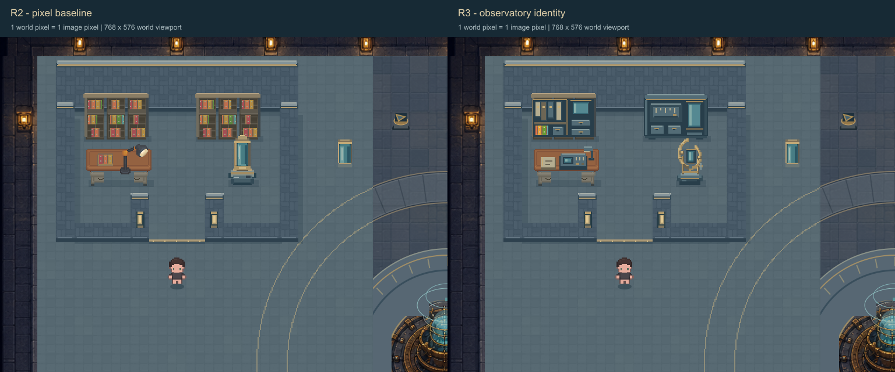
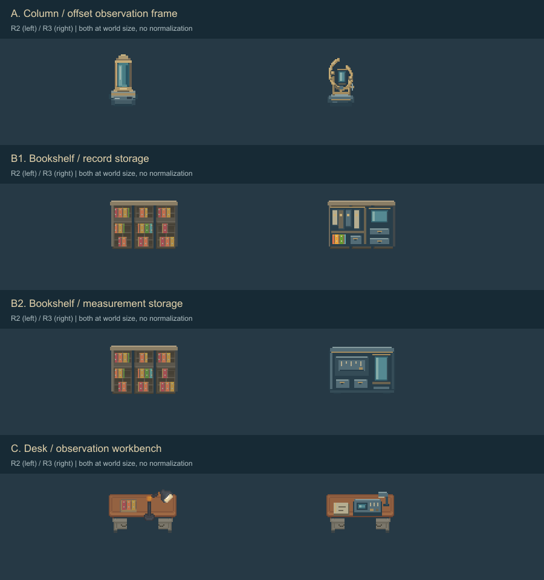
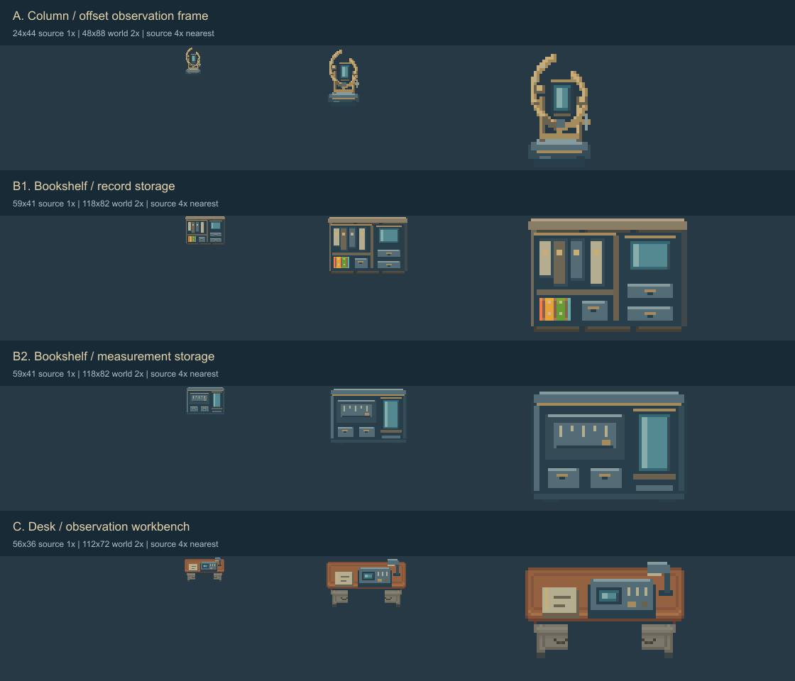
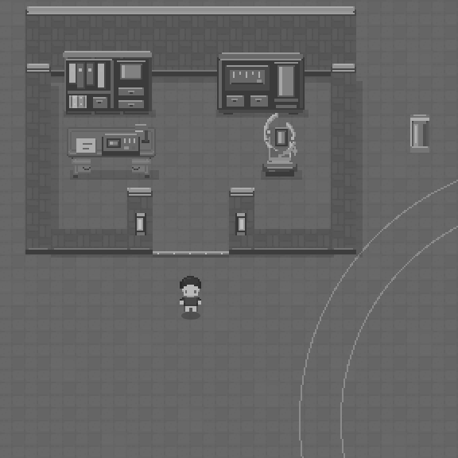
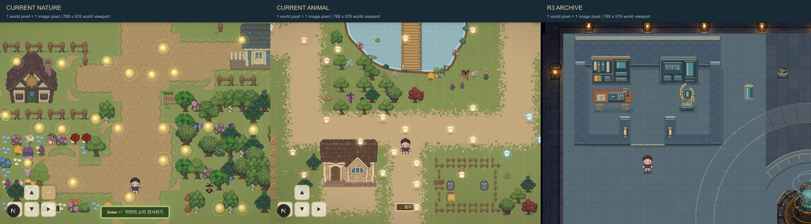

# LAB-2A-R3 — 관측 장치 중심의 Archive 정체성 복원

2026-08-30 · Archive 격리 preview · **사용자 시각 검토 대기**

Preview: <http://127.0.0.1:3000/lab-observatory-identity-preview>

## 변경한 것

R2의 픽셀 크기는 유지하면서, ‘책장 두 개와 일반 스탠드가 있는 서재’로 읽히던 사물의 역할을 바꿨다. 세 핵심 장소에 해당하는 네 sprite(관측 장치·왼쪽 보관대·오른쪽 보관대·작업대)만 수정했다. 바닥·벽·회랑·문턱과 나머지 장치는 R2 그대로다.

원본 관측소의 황동 원형 구조, 청록 유리, 짙은 받침을 참고했다. 원본 방을 잘라 붙이거나 장면을 새로 생성하지 않았다. R2의 편집 가능한 native pixel 제작 코드와 sprite 모듈을 이어 사용했다. ImageGen은 사용하지 않았다.

동일 viewBox `[0,32,768,576]`, 동일 발 위치 `[304,464]`. marker·grid·collision·clearance·bounds off, 1 world px=1 image px. R2/R3 버튼은 카메라·위치·선택한 collision을 유지한다.

## 세 사물의 설계와 출처

| 장소 | R2 → R3 | 재사용 / 파생 / 신규 |
|---|---|---|
| 오른쪽 관측 장치 | 수직 유리 기둥 → 높이와 중심이 어긋난 두 반원 관측 프레임 | 신규24×44 native pixel. 짙은 받침, 두 지지대, 개방된 황동 곡선, 작은 중앙 유리판, 측면 조정 손잡이. 프레임은 지지대·하부 연결부를 통해 받침에 닿음 |
| 왼쪽 기록 보관대 | 반복 책칸 → 큰 기록철 구획 + 작은 책칸 + 보관함·유리 구획 | R2 shelf의 처마·외곽·발을 재사용. 내부 큰 구획·기록철·서랍 신규. 기존 interior/books crop의 일부를 작은 책칸에 사용 |
| 오른쪽 계측 보관대 | 왼쪽과 같은 책장 → 넓은 가로 눈금판 + 세로 유리 구획 + 금속 서랍 | 신규59×41 native pixel. 왼쪽의 세로 기록철과 달리 큰 가로 패널을 중심으로 구성. R3 공통 금속·황동·유리 palette 공유 |
| 기록 작업대 | 책과 높은 스탠드 → 낮은 계측판·기록지·소수 조절부·작은 hood 작업등 | R2 source-table의 좌우 rim·중앙 모듈과 기존 desk 하단 서랍 재사용. 상판 장비 신규. R2 스탠드 및 그 잔여 받침 pixel 제거 |
| 보조 발광 | 기존 유리 기둥의 세로 발광 → 새 유리판과 작은 작업등 위치에 제한된 overlay | R2 벽등 overlay는 그대로. 변경 사물 범위 안의 몇 pixel만 변경 |

재사용 원본 경로는 `public/assets/lab/tables.png`, `public/assets/lab/storage.png`, `public/assets/interior/books.png`, `public/assets/interior/dresser.png`다. R2에서 추출·조합한 `public/design-previews/lab-2a-r2/source-table.png`, `source-books.png`, `shelf.png`, `desk.png`를 읽기만 했다. 원본 crop은 R2 manifest에 기록된 것을 그대로 사용한다. R3 생성 출처와 공유 palette는 [asset-manifest.json](previews/lab-2a-r3/asset-manifest.json)에 기록했다.

보관대와 프레임의 새 구조는 짙은 청회색, 중간 금속색, 좌상단 highlight와 아래 접점의 어두운 색을 공유한다. 황동은 밝음·중간·그늘 세 단계, 유리는 어두운 테두리·중간 면·왼쪽 반사면으로 구분한다. 작업대 상판과 기록 보관대 테두리는 기존 가구의 목재 finish를 유지한다. 모든 사물에 같은 원형 장식을 반복하지 않았다.

눈금은 중립적인 정적 tick이다. 실제 파형·sound category·정답·생물 표본·악기·작은 글자는 넣지 않았다. 프레임은 공중에 뜬 이중 원형 marker glyph가 아니라 받침에 연결된 물리적인 부품으로 표현했다.

## 픽셀·좌표 보존

| sprite | source | world | alpha bbox (source 내부) | 기존 anchor / depth |
|---|---|---|---|---|
| frame | 24×44 | 48×88 | `[1,3,22,40]` | `[392,200]` / 288 |
| records | 59×41 | 118×82 | `[1,1,56,40]` | `[141,126]` / 208 |
| measurement | 59×41 | 118×82 | `[2,2,55,39]` | `[333,126]` / 208 |
| workbench | 56×36 | 112×72 | `[0,2,56,34]` | `[148,216]` / 288 |

모두 **source1px→world2px**, 물체 alpha0/255, 정수 좌표와 nearest-neighbor 표시다. 비균등 stretch나 blur가 없다. 원본1×, world2×, 원본4×는 각각 실제 크기로 배치했으며 사물별 크기를 같은 칸에 맞춰 정규화하지 않았다.

색 수는 frame11, records30, measurement10, workbench25다. 기록 보관대의 색 수에는 재사용 목재와 작은 책칸이 포함된다. 색 수를 화풍 품질의 점수로 취급하지 않는다. [pixel-audit.json](previews/lab-2a-r3/pixel-audit.json) 참조.

R1의 `cohesionConfig.mjs`를 직접 import한다. Archive footprint `[3,3,13,9]`, entrance `[8,12,3,1]`, approach `[8,12,3,3]`, 48×36 맵과 spawn·exit, collision box22×28, sprite72×88, 이동 속도는 유지했다. 기존 캐릭터의 legacy2.25×2.75 표시와 marker 표현도 바꾸지 않았다. 기존 VISUAL_BOUNDS와 object depth를 그대로 재사용한다.

## 발광 없이 남는 형태

프레임은 열린 곡선·지지대·받침, 기록 보관대는 큰 세로 파일과 작은 보관함, 계측 보관대는 넓은 가로 패널과 세로 유리, 작업대는 낮은 상판 계측판으로 구분한다. 이 요소들은 모두 base sprite에 들어 있으므로 emissive off에서도 남는다.

유리의 밝은 반사색과 작업등의 재료색은 sprite 색이다. 별도 emissive overlay는 유리 위 alpha0x33, 작업등 alpha0x22 수준의 작은 면이다. Emissive off는 이 overlay를 제거하며 sprite 반사색까지 지우지는 않는다. 기존 R2 벽등과 범위 밖 원본 이미지의 내재 조명은 비교 조건에 맞춰 유지한다. 광역 안개·화면 암전·bloom·맥동을 추가하지 않았다.

바닥·shadow·foreground는 R2 scene의 값을 그대로 재사용했다. 사물의 바닥 anchor와 접지 폭이 기존 범위 안에 있어 새로 넓은 그림자를 넣지 않았다.

## Desktop / Mobile / 다른 마을

- [Desktop](previews/lab-2a-r3/r3-desktop.png), [시험 구간만·marker off](previews/lab-2a-r3/r3-isolated.png), [marker on](previews/lab-2a-r3/r3-markers.png)
- [Emissive off](previews/lab-2a-r3/r3-emissive-off.png), [Grayscale + off](previews/lab-2a-r3/r3-gray-off.png)
- [Mobile framing](previews/lab-2a-r3/r3-mobile.png), [Mobile off](previews/lab-2a-r3/r3-mobile-off.png), [Mobile grayscale+off](previews/lab-2a-r3/r3-mobile-gray-off.png)
- [390px 실제 UI](previews/lab-2a-r3/mobile-390-ui.png), [320px 실제 grayscale+off UI](previews/lab-2a-r3/mobile-320-gray-off-ui.png)
- [전체 Lab 속 시험 영역](previews/lab-2a-r3/r3-full-scope.png)

390px 화면에서 지도366px/576world=약0.635×, 320px에서는296/576=약0.514×다. source pixel은 각각 화면약1.27px/1.03px로 보인다. frame의 전체 표시 폭은 약30.5px/24.7px다. 이때 작은 손잡이와 눈금은 약해지지만 곡선·받침과 큰 유리판이 남는지 확인했다. 모바일 FOV는 R2와 같아 뒤쪽 보관대의 상단 일부가 프레이밍에 걸린다. 이를 고치기 위해 카메라나 사물 위치를 바꾸지 않았다.

이번 R3 작업 중 두 기존 test route를 실제로 열어 다시 촬영했다. 각 canvas768×576, zoom1. 브라우저768×632의 상단56px UI만 crop했으며 개별 sprite 크기를 다시 맞추지 않았다. 기존 마을의 원래 marker·조작 UI는 촬영에 남는다. 큰 비교판은 뷰어가 축소할 수 있으므로 파일100%에서 비교한다.

## 수행한 검증

| 항목 | 결과 |
|---|---|
| 기존 LAB-1 | PASS. 108 safe slot, 각 block18자리, reachable1047 tile |
| 기존 R1 | PASS. 8px foot graph15032 samples, 기존 collision과 slot 접근 여백 검사. 원본 결과를 덮지 않도록 임시 cwd에서 실행 |
| 기존 R2 | PASS. 기존 검사 내용을 R3 결과 폴더로만 출력하는 별도 runner로 실행. R2 코드·문서·결과 파일 미변경 |
| R3 보존 검사 | PASS. base·foreground 문자열 동일. 네 대상 외 모든 object 동일. 입력·이동·reset·Avatar·marker·fade 코드 구간 byte 동일 |
| 전체 환경 pixel 비교 | 네 대상의 기존 VISUAL_BOUNDS 밖 변경 **0px**. 안쪽 변경21380px. 전체 시험 영역보다 좁은 범위로 검사 |
| Sprite | 정확히2×, binary alpha, 기존 범위 안. 모든 id/depth/bounds 동일 |
| Lint | 새 preview 세 파일 오류·경고 없음 |
| 실제 진입·복귀 | `[304,464]→[304,304]→[304,464]` |
| 실제 책상·뒤벽·서쪽벽 | x269.09 / y190.55 / x141.09에서 정지 |
| 실제 프레임·옆 통로 | y318.55에서 장치 앞 정지, `[464,222.55]`까지 옆 aisle 진입 |
| 실제 가림 | `[208,240]`에서 desk opacity0.32, 전면 벽 가림 완화도 확인 |
| marker | browser DOM108개 유지, 기존 최종 overlay 순서 보존 |
| 실제 입력 | 방향키·32px 이동 버튼·포인터 조작 버튼 확인. 장시간 hold의 정밀 속도 측정은 별도 수행하지 않음 |
| 기존 닫힌 collision 비교 | 동일 R3 그림에서 y414.55에 정지 |
| 모바일 | 실제320·390 viewport 측정, 가로 overflow 없음 |

근거: [browser-movement.json](previews/lab-2a-r3/browser-movement.json), [r3-validation.json](previews/lab-2a-r3/r3-validation.json), [R1](previews/lab-2a-r3/r1-regression.json), [R2](previews/lab-2a-r3/r2-regression.json), [LAB-1](previews/lab-2a-r3/lab1-regression.txt). [가림 화면](previews/lab-2a-r3/r3-foot-fade.png), [옆 통로 화면](previews/lab-2a-r3/r3-side-aisle.png)도 저장했다.

## 시각 판단과 남은 한계

작업자 검수에서는 R2의 서재 인상이 줄고, 발광·글자 없이도 관측 프레임과 계측 가구가 구분된다. 기존 marker는 밝기와 큰 링을 그대로 유지하고 환경은 조용하게 두었다. 특정 소리의 정답을 암시하는 장식은 넣지 않았다.

다만 **관측소 정체성의 최종 합격은 사용자 판단**이다. 다음을 확인받아야 한다.

1. 열린 황동 프레임이 평범한 장식이나 작은 거울보다 ‘관측 장치’로 읽히는가?
2. 두 보관대의 역할 차이가 느껴지면서 같은 시설의 가구처럼 보이는가?
3. 모바일에서 손잡이·눈금이 사라져도 형태가 충분한가?
4. 원본의 낯설고 안전한 관측소 분위기가 돌아왔는가?

R3 프레임은 원본보다 훨씬 단순하며 48px 폭을 넘기지 않아 거대한 landmark 같은 존재감은 제한된다. 기존 벽의 반복감과 시험 영역 밖 고해상도 Lab 아트 차이는 이번 범위 밖이다. 정적 검증 통과를 시각 승인으로 바꾸어 보고하지 않는다.

## 생성 파일과 보호 결과

- `app/lab-observatory-identity-preview/`: `page.js`, `IdentityPreview.js`, `identityArt.mjs`
- `public/design-previews/lab-2a-r3/`: `frame.png`, `records.png`, `measurement.png`, `workbench.png`, `emissive.png`
- `design/2d-map-redesign/tools/`: `build_lab_2a_r3.cjs`, `render_lab_2a_r3.cjs`, `plates_lab_2a_r3.cjs`, `test_lab_2a_r3.mjs`, `test_lab_2a_r2_regression_for_r3.mjs`
- 이 문서와 `previews/lab-2a-r3/`의 이미지·SVG export·검증 결과. 전체 [files.txt](previews/lab-2a-r3/files.txt).

시작 시9845개 기존 파일 hash를 저장해 비교한 결과, **기존 파일 변경0 / 삭제0**이다. [preservation-audit.json](previews/lab-2a-r3/preservation-audit.json) 참조. 기존 미커밋 변경은 보존했다. production·다른 마을·원본 asset·AssetRegistry·이전 Lab preview·문서·연구 데이터는 수정하지 않았다.

새 preview는 local mock 표시와 이동만 제공한다. Supabase·annotation·reward·participant/session 연결, 패키지 설치, Git commit/branch/push, 공개 배포는 하지 않았다. Archive R3에서 멈추며 Spectrum·Signal·LAB-2B 확대나 production 적용은 자동으로 시작하지 않는다.
