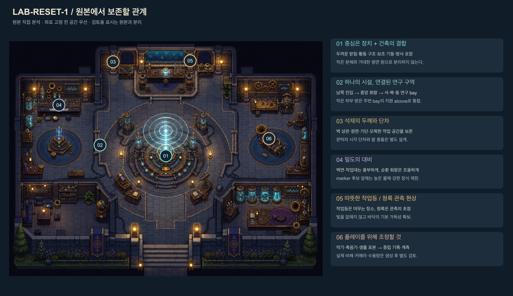
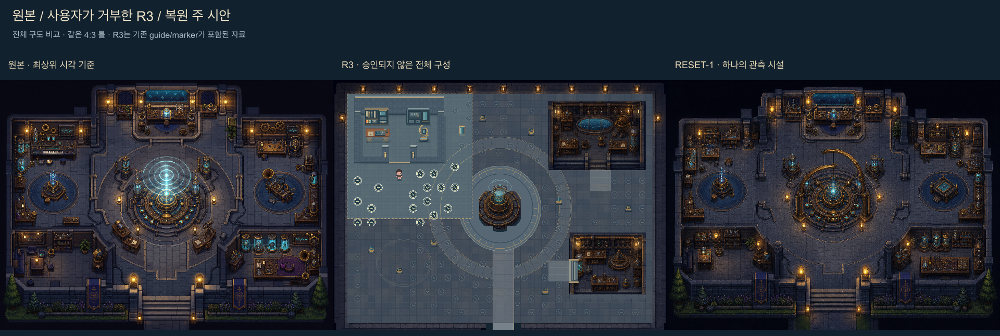
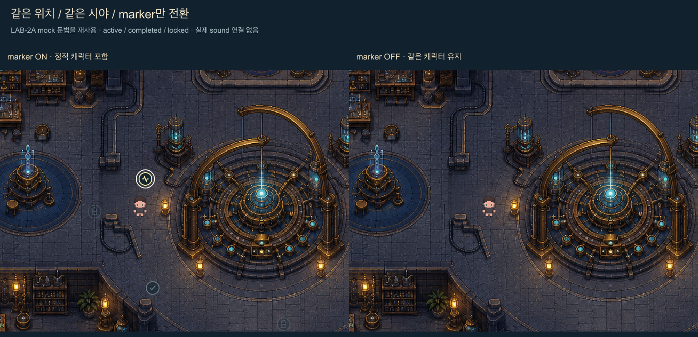
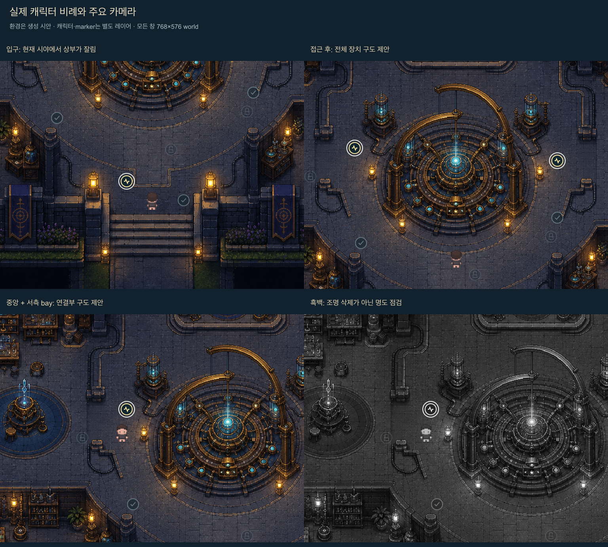
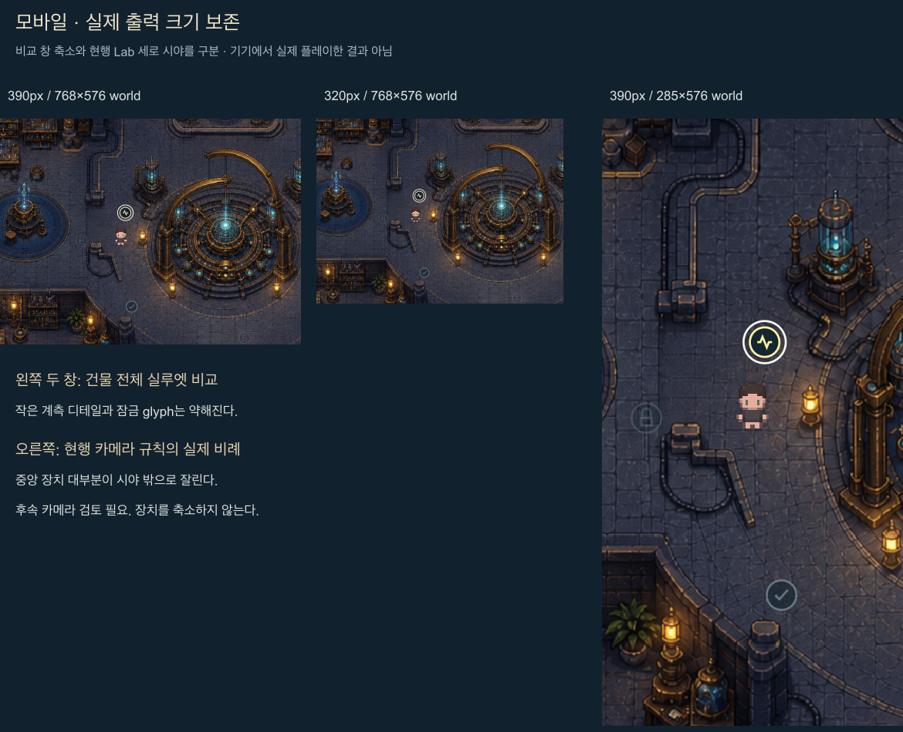
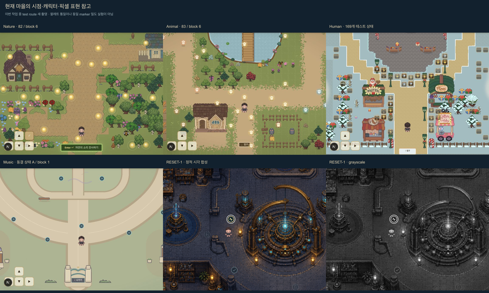
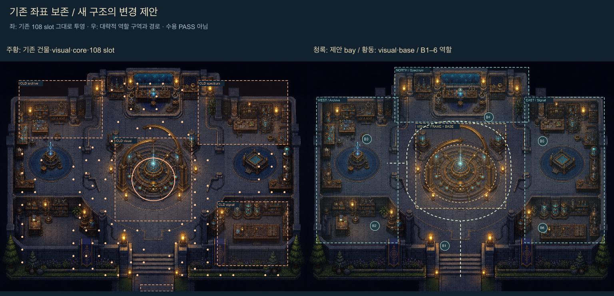

# LAB-RESET-1 — 원본 관측소 콘셉트 복원과 전체 맵 시안

2026-08-30 · **전체 시각 방향 승인 대기 / 정적 시안 / production 미적용**

[로컬 검토 페이지](http://127.0.0.1:8765/) · [독립 HTML 파일](previews/lab-reset-1/index.html) · [생성 원본 크기](previews/lab-reset-1/concept-main.png) · [산출물 목록](previews/lab-reset-1/files.txt)

이번 결과는 원본을 직접 참조한 **하나의 전체 관측소 시안**과 실제 캐릭터 비례의 시각 합성이다. R3의 일부 가구를 다시 고친 결과가 아니다. 원본의 건축·중앙홀·밀도·빛을 우선했으며 기존 LAB-1 좌표에 맞춰 그림을 잘라 붙이지 않았다. 이동·collision·정밀 tile 정합·신규 slot 수용을 검증한 결과가 아니다.

## 1. 직접 확인한 기준과 이전 결과의 취급

- 원본 `design/concepts/lab-sound-observatory-concept-v1.png`와 루트의 사용자 제공 `Codex 이미지 2026년 8월 30일 오후 03_52_53.png`를 모두 열었다. 실제 루트 파일명은 NFD 한글이며 정확한 경로와 SHA-256은 [생성 기록](previews/lab-reset-1/generation-and-composite-manifest.json)에 보존했다. 두 이미지 모두 1448×1086이다.
- LAB-1, LAB-2A, R1, R2, R3 문서와 R3 전체·격리 이미지를 직접 읽고 보았다. LAB-1의 야외형 재구성, 고정된 세 사각형 건물, 수치 비대칭 지시는 이번 사용자 방향으로 대체한다. 과거 문서 자체는 수정하지 않았다.
- LAB-1은 데이터·수용·기존 동선 참고, R1은 열린 공간과 발 충돌 분리 참고, R2는 실제 sprite 배율 조사 참고다. **사용자가 거부한 R3는 승인된 아트 기준이 아니다.**
- `whiteboxConfig.mjs`, `cohesionConfig.mjs`, 전역 아트 문법, Music backlog를 확인했다. Music은 동결하며 이번에는 현재 화면 촬영만 했다.
- Nature·Animal·Human·Music의 현재 test route를 이번 작업 중 새로 촬영했다. 과거 baseline을 현재 화면으로 대체하지 않았다.

## 2. 복원한 관계와 R3에서 바꾼 판단

| 항목 | 이번 주 시안 | R3와 달라진 설계 판단 |
|---|---|---|
| 시설 전체 | 남쪽 문과 중앙홀, 서·북·동 연구 구역이 연속된 석재 시설 | 넓은 광장에 독립 방 이미지 세 개를 놓지 않음 |
| 중앙 장치 | 두꺼운 다단 받침, 기계 본체, 물리적으로 지지되는 열린 황동 곡선, 보조 기둥, 작은 청록 현상 | 작은 sprite 크기에 중심을 제한하지 않음. 넓은 평면 링만 남기지 않음 |
| 건축 | 두꺼운 벽 상판·정면, 기둥, 접지 그림자, 오목한 작업 공간 | 기존 작은 bounds와 얇은 도형 벽을 고정 조건으로 쓰지 않음 |
| 연결 | 중앙 장치 둘레의 회랑과 좌우 개구부, 북측 연구 단 연결 | 일반 서재를 바깥 광장과 분리한 구성을 폐기 |
| 밀도 | 벽 주변 보관대·계측·작업대를 모으고 회랑에는 낮은 대비의 석재 | 모든 바닥을 비우거나 높은 소품으로 채우지 않음 |
| 빛 | 작은 따뜻한 작업등은 머무는 공간을 표시, 청록은 관측 중심을 표시 | 픽셀 통일을 조명과 재료 깊이 삭제로 해석하지 않음 |
| 중립성 | 큰 축음기형 장치와 악기 형태를 제거하고 계측 프레임·기록 설비로 수정 | 일반 가구를 황동색으로 칠하는 것만으로 정체성 복원 판단을 하지 않음 |

서측은 Archive, 북측은 Spectrum, 동측은 Signal의 **역할 배치 제안**이다. 남서·남동 모서리는 각각 서·동 구역의 지원 공간으로 해석한다. 별도 실내 화면·건물 입장 시스템은 도입하지 않는다. 생성 그림의 하부 칸막이는 여전히 별도 방처럼 읽힐 수 있으므로 지원 공간의 연속성과 출입 폭은 정확한 평면 설계에서 재검토해야 한다.

비교판은 전체 구도를 같은 4:3 틀에 놓았다. R3는 기존 파일에 포함된 guide·marker를 그대로 보존했다. 동일 조명·marker 조건의 픽셀 차이 실험은 아니다.

## 3. ImageGen 제작 및 선택 기록

사용한 도구는 **built-in ImageGen**, 총 2회다. CLI/API 전환, 패키지 설치는 하지 않았다.

1. 첫 생성은 원본 두 파일을 직접 reference로 사용했다. [첫 프롬프트](previews/lab-reset-1/imagegen-prompt.txt). 결과는 [미채택 초안](previews/lab-reset-1/concept-draft-not-selected.png)으로 보존했다. 건축은 유지했지만 오른쪽에 축음기처럼 읽히는 장치가 남고 중앙의 열린 프레임이 약해 채택하지 않았다.
2. 초안을 직접 참조해 그 부분과 연구 구역 연결부를 수정했다. [수정 프롬프트](previews/lab-reset-1/imagegen-correction-prompt.txt). 다른 화풍 A/B 탐색이 아닌 같은 주 시안의 제작 수정이다. 열린 물리 프레임, 좌우 개구부, 정답을 암시하는 큰 사물 제거를 확인하고 [주 시안](previews/lab-reset-1/concept-main.png)으로 선정했다. 선정은 작업자의 검토 후보 선택이며 사용자 시각 승인이 아니다.

| 항목 | 실제 값 |
|---|---|
| 우선 요청 크기 | 1536×1152, 4:3, 개념상 48×36 |
| 실제 반환 크기 | 두 생성물 모두 **1448×1086**, 4:3 |
| 검토 좌표계 | 1536×1152 world, 32px/tile |
| 검토용 변환 | 전체 이미지를 균일한 192/181 ≈ 1.06077배로 nearest-neighbor 리샘플. crop·비균등 stretch 없음 |
| 생성 이미지 내용 | 환경만. 캐릭터·mock marker·검토 텍스트는 생성 후 별도 레이어 |
| 보존 파일 | 첫 초안, 선택본, 두 프롬프트, reference 경로·hash, 카메라·레이어 기록 |

이 비정수 리샘플은 시각 검토용이다. **ImageGen이 정확한 32px tile 정합, source1→world2 규격 또는 최종 pixel sprite 품질을 보장하지 않는다.** 원본의 계단형 윤곽과 풍부한 형태는 참고했지만 생성 이미지에는 작은 연속 명암과 불균일한 픽셀 덩어리가 남는다. 최종 제작 방식을 아직 결정하지 않았다.

## 4. 실제 캐릭터와 marker 합성 기준

`components/ZoneMap.js`의 `SPRITE_W=72`, `SPRITE_H=88`, `PixelChar`, `components/AssetRegistry.js`의 `WORLD_CHARACTER`를 확인했다. Nature·Animal·Music도 공통 캐릭터를 사용한다. 현재 브라우저에서도 72×88 SVG, viewBox 32×32를 확인했다.

- 현재 body → clothes → hair의 32×32 idle 첫 프레임을 그대로 합성했다. 입구/접근 화면은 up row1, 인접 연구 구역은 down row0다.
- **72×88은 표시 영역이다.** 현재 SVG에는 `preserveAspectRatio="none"`이 없으므로 기본 `xMidYMid meet`에 따라 내용은 72×72이고 위아래 8px 여백이 생긴다. R2 문서의 “2.25×2.75 비균등 표시”를 그대로 반복하지 않았다. 이번 합성은 실제 코드의 기본 SVG 동작을 따른다. 기존 코드·문서는 수정하지 않았다.
- 논리 발 기준은 표시 영역 아래 중앙이다. 보이는 발 픽셀과 논리 anchor 사이의 여백도 기존 동작 그대로 남겼다. 별도 가짜 접지 그림자로 이 차이를 숨기지 않았다. 후속 구현에서 발 접점 검토가 필요하다.
- Marker는 LAB-2A의 mock 문법을 분리 복제했다. 내부 반지름14, active 외부 반지름20, active/완료/잠금 opacity 1/.58/.3이다. 현재 production Lab marker를 교체한 결과가 아니다.
- 9개만 대표 위치에 놓았다. ID·group·block·annotation과 연결하지 않았고, sound 수용량 시험으로 쓰지 않았다. 첫 합성에서 캐릭터 머리와 active ring이 겹친 위치 및 벽에 가까운 완료 marker를 옮긴 뒤 다시 보았다. 이는 수동 시각 조정이며 clearance 검증은 아니다.
- 환경·캐릭터·marker·검토 경로·기존 whitebox를 별도 SVG 그룹으로 보존했다. PNG는 열람용 합성이고 HTML/SVG에서 레이어를 구분할 수 있다. 환경 내부의 벽·장치·조명은 분리된 runtime 에셋이 아니다.

## 5. 주요 카메라와 실제로 드러난 제약

카메라 좌표는 `[x,y,width,height]` world px다. 정적 검토에 필요한 카메라 값만 만들었고 기존 카메라 설정을 수정하지 않았다.

| 화면 | 시야 / 출력 | 판단 |
|---|---|---|
| 전체 | `[0,0,1536,1152]` | 시설·남쪽 진입·세 연구 구역의 관계 확인 |
| 입구 | `[384,576,768,576]`, 발 `[768,960]` | 현행 24×18 및 남쪽 clamp 범위. 장치 하부·진입축은 보이지만 **상부 프레임은 잘림** |
| 중앙 접근 | `[384,260,768,576]`, 발 `[768,790]` | 전체 장치를 읽기 위한 구도 제안. 현재 player-center 추적 카메라를 재현한 값은 아님 |
| 중앙 + 서측 연구 구역 | `[192,240,768,576]`, 발 `[500,570]` | 서측 관측 설비·열린 문턱과 중앙 본체가 함께 보임. 동측 끝 보조 기둥 등은 화면 밖일 수 있음. 구도 제안 |
| 390px / 320px 비교 창 | 같은 768×576 world → 390×293 / 320×240 출력 | 큰 프레임과 active marker는 남음. 작은 계측 장식·잠금 glyph는 약함 |
| 현행 Lab 세로 규칙 | `[358,268,285,576]` → 390×788 | 390×844 기기에서 HUD56 제외. 가로시야 `round(576×390/788)=285`. 중앙 장치 대부분이 잘려 **후속 카메라 검토 필요** |
| 현행 Lab 가로 규칙 | `[0,268,1242,576]` → 720×334 | 720×390에서 HUD56 제외. 상대적으로 넓은 시설 문맥을 볼 수 있음 |

입구에서 완전한 장치 실루엣까지 즉시 보이게 할지는 승인 후 결정할 사항이다. 이를 해결하려고 장치를 작게 만들지 않았다. 접근하면서 상부가 드러나는 연출, 제한적인 카메라 시선 이동, 세로 화면용 framing을 후속 단계에서 비교할 수 있다. 이번에는 구현하지 않았다.

전체 [환경만](previews/lab-reset-1/full-environment.png), [전체 grayscale](previews/lab-reset-1/full-grayscale.png), [모바일 grayscale](previews/lab-reset-1/mobile-grayscale.png), [카메라 범위](previews/lab-reset-1/camera-ranges.png), [검토 경로](previews/lab-reset-1/route-review.png)도 저장했다.

Grayscale에서 벽 상판·기단·회랑과 active ring은 구분된다. 얇은 황동 매립선, 어두운 하부 칸막이와 잠금 marker는 약해진다. **흑백은 조명 off가 아니다.** 생성 환경의 빛은 내재되어 있으므로 완전한 무발광 가독성·emissive 면적·장치/marker 대비 정량 검증은 미수행이다.

## 6. 현재 마을과의 조화

Nature `/nature-test`, Animal `/animal-test`, Human `/human-village-test`, Music `/music-test`를 768×632 브라우저에서 촬영하고 위 HUD56을 제외한 768×576을 비교했다. Nature/Animal은 마지막 block의 82/83개, Human은 169개 전체 테스트 상태, Music은 A·block1이다. 실제 A/B 참여자 화면의 동등한 marker 밀도 비교가 아니다.

같은 표시 크기의 캐릭터를 쓰며 top-down 3/4 상판·정면·측면을 읽을 수 있다. 그러나 Lab의 생성 환경은 Nature/Animal의 작은 명확한 색 덩어리보다 명암이 촘촘하고 전체 조도가 낮다. **같은 게임의 최종 pixel 품질로 승인됐다고 판단하지 않는다.** Lab의 고유한 석재·황동·조명·밀도를 보존하면서 공통 윤곽과 재료 표현을 맞추는 것이 후속 과제다. Music 개선은 재개하지 않았다.

## 7. 기존 whitebox와 달라지는 구조

좌측은 config에서 읽은 기존 구조물·중앙 visual/core·**108개 기존 slot 좌표 그대로**를 새 그림 위에 투영한 것이다. 우측은 수동 지정한 대략적인 연구 구역·장치 visual·받침과 검토 경로다. 우측 도형은 확정 collision이나 tile mask가 아니다. 이미지 색을 읽어 collision을 추출하지 않았다.

| 구분 | 유지 또는 변경 제안 |
|---|---|
| 유지 가능한 설계 원칙 | 48×36 / 1536×1152 기준, 남쪽 진입과 출구 방향, 중앙 기준점, 양방향 순환, 여섯 block 순서, A/B filtering 및 데이터 |
| 정확한 좌표까지 유지 가능하다고 보지 않는 것 | 남쪽 gate/spawn 높이, 문턱, 세 bay의 개구부. 방향은 유지하되 이미지의 계단·기단과 맞춰 재측정 |
| 연구 구역 재배치 | Archive `[3,3,13,9]` → 서측 bay, Spectrum `[31,3,14,10]` → 북측 bay, Signal `[34,22,11,10]` → 동측 bay+지원 공간. 기존 사각형 footprint를 그대로 이식하지 않음 |
| 중앙 재설계 | 기존 visual `[18,12,12,13]`와 core 중심 `(24,18.5)`/r3.35tile을 고정하지 않음. 새 프레임+보조 기둥 visual은 대략 `[545,312,450,425]` world 영역. 이는 선택 도식용 rough envelope이며 exact bbox 측정 아님 |
| visual / collision 분리 | 프레임 상부 투영, 보조 기둥, 높은 벽 cap은 발 위치 solid와 분리. 방사형 포장 전체를 막지 말고 실제 받침·지지대만 독립 solid로 정의할 필요 |
| 회랑·문턱 | 좌우 중앙 개구부, 북측 단차, 남서/남동 지원 공간 입구를 연결 그래프로 다시 설계. 보이는 낮은 선을 통행 가능으로 단정하지 않음 |
| slot 재배치 가능성 | 기존 B3은 서측 기둥·작업대, B4는 새 북측 bay, B5는 동측 설비, B1/2/6은 남쪽 기단·지원 공간과 겹칠 가능성. 전 block 재감사 필요 |
| 아직 좌표화하지 않은 것 | 외곽 실내 바닥 mask, 계단/문턱의 통행 여부, 기둥 발 실형상, 장치 받침 경계, foreground 범위, 3×3 approach, 모든 slot 접근 여백 |

원본에 가까운 깊이가 돌아온 만큼, 넓고 빈 바닥을 전제로 통과했던 LAB-1 수용 결과를 새 그림으로 이전할 수 없다. 지원 구역을 열고 작업대를 벽 쪽으로 묶는 것은 수용 후보 개선 방향일 뿐 PASS 근거가 아니다.

## 8. 데이터 보호와 미검증 수용량

현재 `data/sound_metadata.json`을 읽어서 Lab 총169, A84, B85와 각 block 수량을 확인했다. 기존 config의 검증 함수를 import할 때 얻은 결과는 기존 슬롯108·각 block18·reachable1047·오류 없음이다. [읽기 전용 snapshot](previews/lab-reset-1/whitebox-snapshot.json)에 기록했다. 이 결과는 **기존 whitebox에만 해당**한다.

| block | A 필요 | B 필요 | 새 구조의 역할 배분 후보 | 새 수용 검증 |
|---|---:|---:|---|---|
| 1 | 15 | 15 | 남쪽 접근 + 남측 회랑 | 미검증 |
| 2 | 15 | 15 | 남서 지원 공간 + 서측 회랑 하부 | 미검증 |
| 3 | 15 | 15 | 서측 Archive bay + 바깥 접근부 | 미검증 |
| 4 | 15 | 15 | 북측 Spectrum bay + 북측 회랑 | 미검증 |
| 5 | 15 | 15 | 동측 Signal bay 상부 + 동측 회랑 | 미검증 |
| 6 | 9 | 10 | 남동 지원 공간 + 남측 회랑 우측 | 미검증 |

역할 배분은 sound의 block을 바꾸는 제안이 아니다. 각 기존 block의 위치를 수용할 공간 후보를 적은 것이다. 169개를 동시에 배치하지 않으며 108은 과거 여유 slot 설계다. 이번에는 정확한 새 slot 좌표·clearance·reachability를 만들지 않았으므로 A84/B85 수용 PASS를 주장하지 않는다.

## 9. 실제 검토와 남은 일

**수행:** 원본 두 장·R3 전체/격리·현재 네 마을 열람, ImageGen 2회와 결과 비교, 큰 sound-source 형태 수정, 캐릭터 source·SVG 표시 방식 확인, 정적 레이어 합성, 전체/입구/중앙/인접/모바일/흑백 검토, 기존 좌표 overlay, metadata 수량 확인, 로컬 HTML 카메라·marker·grayscale·경로·기존 슬롯 레이어 전환, 브라우저 화면 캡처, 기존 파일 hash 보존 비교.

브라우저의 실제 확인 치수·레이어 상태·이미지 로딩 결과는 [검토 기록](previews/lab-reset-1/browser-review.json)에 별도 기록했다. 고정 카메라를 선택하고 시각 레이어를 켜고 끄는 기능만 있다. 이동 입력·게임 루프·새 collision·annotation 연결은 없다.

**미검증:** 실제 이동과 코너 충돌, 계단/문턱 진입, 전체 순환 graph, A/B 수용량, 108개 후보 clearance, foreground y-sort/자동 가림 완화, 모바일 실기기 플레이, 전체 프레임을 보여 주는 카메라 구현, 완전 무발광, emissive 대비 수치, 최종 tile 정합·pixel cluster 품질, production build. 실제 기능을 변경하지 않았으므로 production build나 기존 게임의 기능 PASS를 이번 시안의 성과로 제시하지 않는다.

작업자 시각 판단은 다음과 같다.

- 원본과 같은 관측 시설이라는 건축·재료·빛의 관계, 큰 중앙 본체와 프레임의 존재감은 회복 후보로 제시할 수 있다.
- 세 연구 구역이 중앙 회랑으로 연결되는 방향은 보이나, 하부 지원 공간은 닫힌 별도 방으로 읽힐 여지가 남는다.
- 중앙 active marker는 밝은 이중 외곽선으로 구분된다. 어두운 벽 근처 locked 상태와 모바일 작은 glyph는 개선 검토가 필요하다.
- 큰 실루엣은 유지되지만 기둥·받침의 collision과 상부 프레임의 가림은 아직 설계되지 않았다.
- 사용자가 원본의 매력을 다시 느끼는지는 사용자 시각 승인 사항이다. 기술 체크 완료로 대체하지 않는다.

## 10. 승인 후 첫 구현 범위 제안 — 이번에는 시작하지 않음

**남쪽 입구 → 중앙 장치 전면 → 서측 순환 회랑 → 인접 Archive bay의 한 작업 영역 → 같은 길로 복귀**를 첫 연결 구간으로 제안한다. Archive만 떼어 구현하지 않는다.

이 구간에서 먼저 별도의 논리 바닥/solid 도식, 높은 frame·벽의 visual footprint와 지상 받침 collision, 문턱 접근, 캐릭터 발 기준, marker 접근 공간과 카메라 framing을 함께 검증한다. 전체 A/B 슬롯 감사는 별도 필수 관문이며 부분 구간 성공을 전체 수용 성공으로 확장하지 않는다. 이후 최종 아트 분리·pixel 제작 방식을 결정한다.

## 11. 생성 파일과 기존 작업 보호

새 파일은 요청된 이 문서와 `previews/lab-reset-1/` 안에만 만들었다. 이 폴더에는 분석/비교 보드, ImageGen 초안·선택본, 프롬프트, 별도 레이어 SVG와 PNG, 실제 마을 캡처, 모바일 자료, 독립 HTML 검토 문서, 재현용 두 제작 도구, metadata/whitebox snapshot·manifest·보존 기록이 있다. [전체 목록](previews/lab-reset-1/files.txt)을 참고한다.

Next.js route나 코드를 만들지 않았으므로 Next.js API를 적용하지 않았다. 기존 preview와 공용 설정은 그대로다. 검토 페이지는 이 자료 폴더만 서비스하는 localhost 정적 HTML이며 공개 배포가 아니다.

시작 시 **기존 10,652개 파일 SHA-256**을 저장해 비교했다. 최종 비교 결과 **기존 파일 변경0 / 삭제0**이다. 기존 미커밋 변경도 그대로 보존했다. [보존 기록](previews/lab-reset-1/preservation-audit.json)에 결과가 있다. 이번 작업이 작성하는 경로는 위 신규 두 경로뿐이다.

production renderer/runtime assets, sound ID·metadata·A/B filtering·block 분포·annotation/연구 데이터, participant/session·재화·해금, Museum·Supabase·DB, 다른 마을·월드맵·Music은 수정하지 않았다. Git commit·branch·push, 기존 결과 삭제·덮어쓰기, 후속 플레이 구현, 공개 배포는 하지 않았다.

## 12. 사용자 승인 요청

승인할 사항은 **이 전체 시각 방향**이다: 원본의 공간감과 신비로움, 중앙 장치의 비례, 석벽의 깊이와 연구 구역 밀도, 세 연구 구역의 연결, 실제 캐릭터와의 조화. 입구에서는 상부를 다 보여 주지 않고 접근하며 드러내는 방향과 모바일 framing의 후속 재검토도 함께 확인이 필요하다.

이번 승인을 기존 좌표 유지, 최종 sprite, 전체 슬롯 수용 또는 production 적용 승인으로 해석하지 않는다. 여기서 멈추고 전체 시각 방향 승인을 기다린다.
