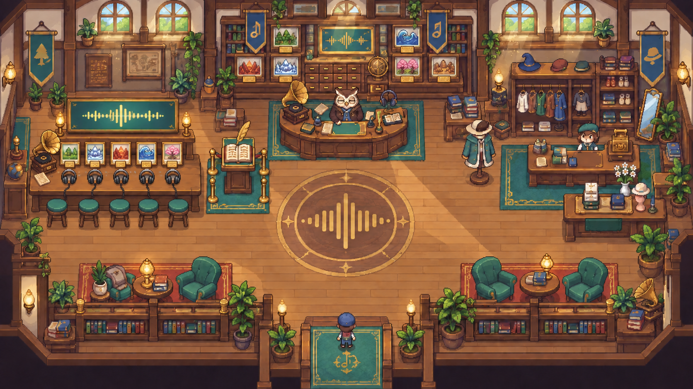
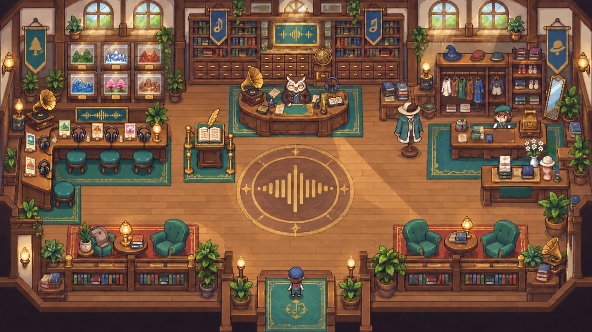

# Sound Museum 최종 보완 시안 2종

요청 방향: 1안의 전체 구조·중앙 부엉이 큐레이터·밝은 색감을 유지하고, 3안 왼쪽의 헤드폰 청취 공간을 결합한다.

## 공통 기능 배치

- 왼쪽: 현재 소리 재생, 최대 5개 표현 후보 확인 및 투표
- 중앙: 부엉이 큐레이터와 전시 현황 장부
- 중앙 후면: 6개 마을별 전시 진행 현황
- 오른쪽: 기존 의상 상점
- 하단 중앙: 입구와 플레이어 스폰

## Final A — Linear Listening Bar

- 직선형 5석 청취 바
- 후보 카드 5개, 헤드폰 5개, 좌석 5개가 일대일로 대응
- 넓은 중앙 동선과 기능 인지가 가장 명확함
- 기존 `LibraryRoom`의 왼쪽 상호작용 영역을 하나의 직사각형 충돌·근접 존으로 구현하기 쉬움
- 추천 용도: 실제 게임 제작 베이스

## Final B — L-shaped Listening Lounge

- 가로 3개 + 세로 2개로 구성된 ㄱ자형 5개 청취 스테이션
- 전시물 6개를 왼쪽 벽면에 유지해 박물관 정체성이 더 강함
- 직선형보다 공간이 생활형 라운지처럼 보이고 중앙 바닥이 더 넓게 느껴짐
- 충돌 영역과 상호작용 프롬프트 위치는 직선형보다 세분화가 필요함
- 추천 용도: 공간의 개성과 실제 박물관 경험을 더 중시할 때

## 최종 추천

기능 전달과 구현 안정성을 우선하면 **Final A**가 낫다. 박물관 전시의 존재감과 탐색하는 느낌을 우선하면 **Final B**가 낫다. 두 안 모두 투표 후보 수 상한인 5개를 청취 스테이션 수에 반영했다.

## ImageGen 최종 프롬프트 요약

Built-in ImageGen의 compositing 및 precise-object-edit 흐름을 사용했다.

- Image 1: `01-central-listening-hall.png` — 편집 대상이자 전체 구조·색감 기준
- Image 2: `03-lantern-archive-shop.png` — 왼쪽 청취 테이블 참고 이미지
- Final A: 1안의 나머지 구성을 고정하고 왼쪽 전시 케이스만 5석 직선형 헤드폰 청취 바로 교체. 6개 전시 진행 패널은 중앙 후면으로 재배치.
- Final B: 1안의 나머지 구성을 고정하고 왼쪽을 가로 3석·세로 2석의 ㄱ자형 청취 라운지로 교체. 6개 전시 진행 패널은 왼쪽 벽에 유지.
- 공통 제약: 밝은 허니오크·크림·청록 팔레트, 중앙 부엉이, 우측 상점, 입구, 중앙 메달리온, 독서 공간과 조명을 변경하지 않음. UI·문자·워터마크 없음.

