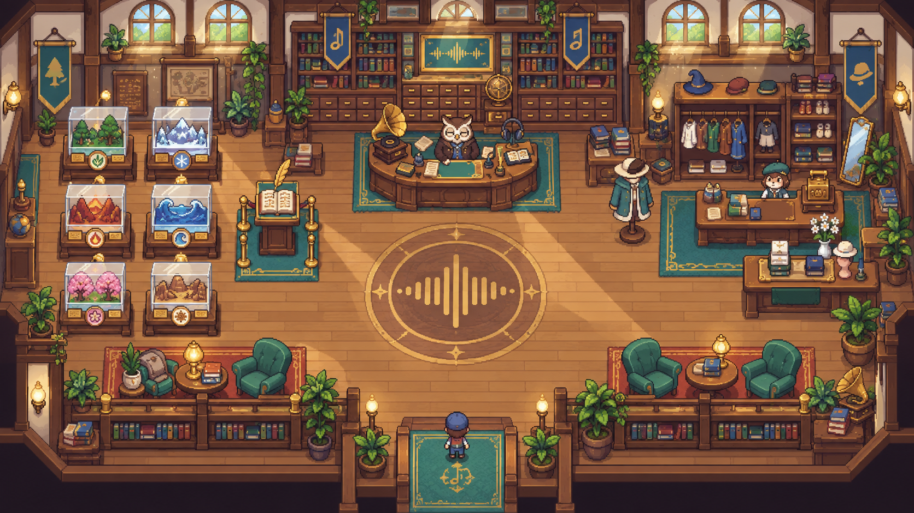
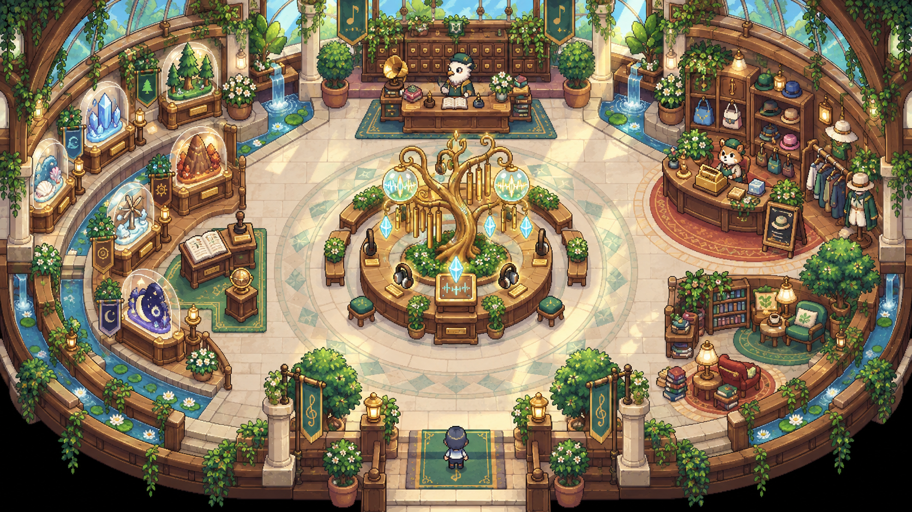
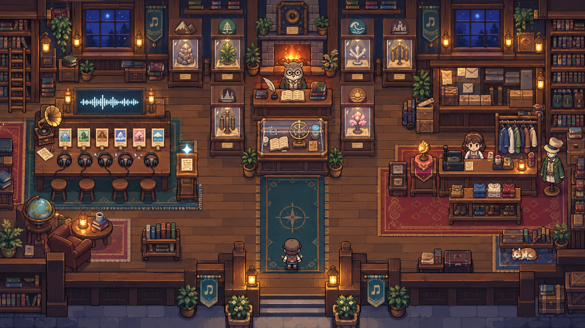

# Sound Museum 디자인 시안 3종

제작일: 2026-09-23

이 폴더는 `PROJECT_SUMMARY.md`, 현재 `SoundMuseum.js`/`LibraryRoom.js`, 기존 마을 비주얼과 사용자가 제공한 5개 레퍼런스를 바탕으로 만든 **디자인 검토용 콘셉트**다. 아직 런타임에 연결한 게임 에셋은 아니다.

## 공통 설계 원칙

- 한 화면 안에서 캐릭터가 직접 걸어 다니는 2D 탑다운 공간
- 하단 중앙 입구, 최소 캐릭터 2명 폭의 주 동선, 되돌아 나올 수 있는 순환형 경로
- 기존 기능을 물리적인 장소로 번역
  - 소리 전사 투표: 청음 데스크/헤드폰/파형 장치
  - 현재까지의 전시 현황: 6개 마을 전시 케이스 + 장부 키오스크
  - 상점: 카운터, 의상 진열, 마네킹, 오늘의 상품
- 기존 투표·전시·상점 카드 UI와 데이터 로직은 유지하고, 상호작용 지점에서 오버레이로 호출
- 32px 전후의 논리 타일을 4배 확대한 듯한 굵고 읽기 쉬운 픽셀 클러스터
- 동물의 숲 계열의 편안한 생활형 공간 감성만 참고하고, 캐릭터·로고·정확한 배치·고유 소품은 복제하지 않음

## 01. Central Listening Hall

가장 정석적인 도서관/박물관형이다. 좌측 전시, 중앙 청음·투표, 우측 상점이 입구에서 즉시 보인다.

- 좌측: 여섯 마을을 상징하는 유리 전시 케이스와 전시 현황 장부
- 중앙: 큐레이터 데스크, 파형 문양, 청음 장치와 투표 인터랙션
- 우측: 의류 카운터, 옷걸이, 마네킹, 계산대, 오늘의 상품
- 장점: 현재 `LibraryRoom`의 좌/중앙/우 구조에 가장 가깝고 구현 위험이 가장 낮음
- 주의: 전시 케이스 앞과 중앙 데스크 사이의 실제 충돌 여유를 2타일 이상 확보해야 함

## 02. Resonance Conservatory

사운드 박물관만의 고유성을 가장 강하게 보여 주는 식물원형 원형 전시관이다.

- 좌측 곡면: 여섯 마을 전시 케이스와 장부 키오스크
- 중앙: 사운드 트리, 헤드폰, 파형 결정으로 구성한 투표·청음 링
- 우측 곡면: 작은 부티크형 상점
- 상단: 카드 캐비닛과 큐레이터 데스크
- 장점: 월드맵의 정원·자연 요소와 가장 잘 이어지고 랜드마크성이 큼
- 주의: 원형 충돌과 카메라 크롭 대응이 필요해 구현량이 1안보다 큼. 중앙 구조물은 이동을 막지 않도록 충분한 링 폭이 필요함

## 03. Lantern Archive & Curio Shop

해 질 녘의 소도시 아카이브와 잡화점이 합쳐진 가장 친밀한 안이다.

- 좌측: 긴 청음 테이블, 5개 후보 슬롯, 헤드폰, 파형 스크린
- 중앙·상단: 여섯 마을 전시 캐비닛, 장부, 큐레이터, 벽난로
- 우측: 너굴상점 계열의 따뜻한 생활형 상점 문법을 참고한 독립 의류 코너
- 장점: 첨부 레퍼런스의 진한 목재 도서관 분위기를 가장 충실히 계승
- 주의: 현재 밝은 마을 팔레트와 연결하려면 최종 제작 때 그림자 대비를 약 15~20% 낮추는 편이 좋음

## 추천

**1안을 제작 베이스로 추천한다.** 기존 `LibraryRoom`의 상호작용 구조를 거의 그대로 보존하면서도 박물관·도서관·상점이 한눈에 읽힌다. 여기에 2안의 식물과 황동 음향 오브젝트를 약하게 섞으면 현재 월드맵의 밝고 풍성한 분위기와도 자연스럽게 이어진다.

## 최종 보완 시안

사용자 피드백에 따라 1안의 전체 구조·중앙 부엉이·색감을 유지하고 3안의 왼쪽 청취 공간을 결합한 최종 시안 2종을 추가했다.

- `04-final-a-linear-listening-bar.png`: 직선형 5석 청취 바
- `05-final-b-l-shaped-listening-lounge.png`: ㄱ자형 5개 청취 스테이션
- 상세 비교: `FINAL_HYBRID_VARIANTS.md`

## 구현 시 고정해야 할 기능 불변 조건

1. `SoundMuseum.js`의 투표 후보 로딩, 실제 재생 후 투표 허용, 투표 저장 및 다음 후보 흐름을 변경하지 않는다.
2. `ExhibitDisplay`의 6개 Zone 진행 현황과 `Shop`의 재화·구매·장착 로직을 그대로 유지한다.
3. 상호작용 카드가 열릴 때 이동을 잠그고, 닫기·ESC·배경 클릭·내비게이션 종료 사유 추적을 유지한다.
4. 가구의 시각 영역과 충돌 박스가 일치해야 한다.
5. 데스크톱과 모바일 모두 입구에서 세 기능까지 도달 가능해야 한다.
